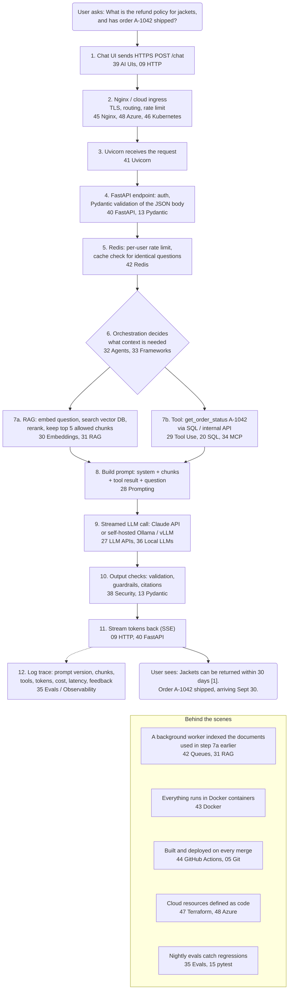
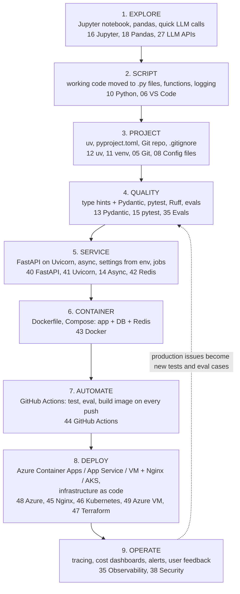
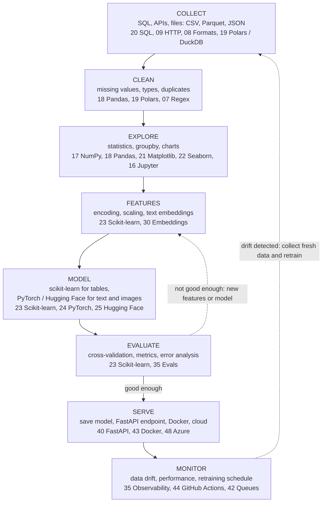

# 00 - Big Picture: How Everything Connects

<!-- nav:start -->
**Index:** [All guides](../README.md) | **Next:** [01 - Core Concepts: Code, Packages, APIs and SDKs](01_core-concepts.md)
<!-- nav:end -->

Start here. This guide is the map of the whole pocket guide: how the tools fit together, how a request travels through a real AI application, how code goes from your laptop to production, and which guide to open for any question.

## Contents

1. [How to Use This Pocket Guide](#1-how-to-use-this-pocket-guide)
2. [The Map: Layers of the Stack](#2-the-map-layers-of-the-stack)
3. [Journey of One Request Through an AI App](#3-journey-of-one-request-through-an-ai-app)
4. [From Idea to Production (Development Lifecycle)](#4-from-idea-to-production-development-lifecycle)
5. [The Data and ML Lifecycle](#5-the-data-and-ml-lifecycle)
6. [The AI Application Ladder](#6-the-ai-application-ladder)
7. [Where Code Runs](#7-where-code-runs)
8. [Which Tool for Which Job](#8-which-tool-for-which-job)
9. [How the Pieces Talk to Each Other](#9-how-the-pieces-talk-to-each-other)
10. [Learning Paths](#10-learning-paths)
11. ["I Want To..." Quick Finder](#11-i-want-to-quick-finder)
12. [Core Mental Models in One Page](#12-core-mental-models-in-one-page)
13. [Windows, macOS and Linux Differences](#13-windows-macos-and-linux-differences)
14. [Practice and Extras](#14-practice-and-extras)

---

## 1. How to Use This Pocket Guide

> How the guides are organised. Numbered from basic to advanced; every guide has the same structure.
>
> Use it on your first visit, or when you are not sure where to look.

Every guide follows the same layout:

```text
# NN - Topic
Introduction      what it is, WHY it exists, a mental model diagram, key terms, where it fits
  Official docs   links to the official home pages for the latest, authoritative information
Contents          numbered sections
0. Flags and Parameters   how commands / calls are built, every flag explained (where relevant)
1..N. Sections    each opens with a short summary (what, how, when to use it), then commands with comments
Troubleshooting   common errors and fixes
```

Reading strategy:

- **Learning a topic**: read the Introduction and mental model first, then skim section titles, then try the examples.
- **Looking something up**: use the Contents list or section 11 of this page.
- **Debugging**: jump to the Troubleshooting table at the end of the relevant guide.
- **Need the very latest details** (new versions, changed APIs, current model names): open the **Official docs** table at the end of each guide's Introduction.

## 2. The Map: Layers of the Stack

> Every guide placed in the layer of the stack it belongs to. Lower layers are foundations used by everything above them.
>
> Use it for seeing how a topic relates to the rest.

Read from the bottom up: each layer builds on the ones below it.

| Layer (top = closest to users) | Guides |
|---|---|
| **Cloud and operations** | [48 Azure](48_azure.md), [49 Azure VM + Ollama](49_azure-vm-ollama.md), [47 Terraform](47_terraform.md), [46 Kubernetes](46_kubernetes.md), [45 Nginx / HTTPS](45_nginx-https.md), [44 GitHub Actions (CI/CD)](44_github-actions.md) |
| **Packaging and serving** | [43 Docker](43_docker.md), [42 Redis / Queues](42_redis-queues.md), [41 Uvicorn](41_uvicorn.md), [40 FastAPI](40_fastapi.md), [39 AI UIs](39_ai-ui.md), [50 Project Structure](50_project-structure.md), [51 Project Templates](51_project-templates.md) |
| **AI engineering** | [26 LLM Fundamentals](26_llm-fundamentals.md), [27 LLM APIs](27_llm-apis.md), [28 Prompting](28_prompt-engineering.md), [29 Tool Use](29_tool-use.md), [30 Embeddings / Vector DBs](30_embeddings-vector-db.md), [31 RAG](31_rag.md), [32 Agents](32_ai-agents.md), [33 Frameworks](33_agent-frameworks.md), [34 MCP](34_mcp.md), [35 Evals / Observability](35_evals-observability.md), [36 Local LLMs](36_local-llms.md), [37 Fine-tuning](37_fine-tuning.md), [38 Security](38_ai-security.md) |
| **Data and ML** | [17 NumPy](17_numpy.md), [18 Pandas](18_pandas.md), [19 Polars / DuckDB](19_polars-duckdb.md), [20 SQL](20_sql.md), [21 Matplotlib](21_matplotlib.md), [22 Seaborn](22_seaborn.md), [23 Scikit-learn](23_scikit-learn.md), [24 PyTorch](24_pytorch.md), [25 Hugging Face](25_hugging-face.md) |
| **Python** | [10 Basics](10_python-basics.md), [11 venv](11_python-virtual-environment.md), [12 uv](12_uv.md), [13 Pydantic](13_pydantic.md), [14 Async](14_async-python.md), [15 pytest](15_pytest.md), [16 Jupyter](16_jupyter.md) |
| **Foundations** | [01 Core Concepts](01_core-concepts.md), [02 Markdown](02_markdown.md), [03 Terminal / PowerShell](03_terminal-powershell.md), [04 Linux](04_linux.md), [05 Git](05_git.md), [06 VS Code](06_vscode.md), [07 Regex](07_regex.md), [08 YAML / JSON](08_yaml-json.md), [09 HTTP / APIs](09_http-apis.md) |

## 3. Journey of One Request Through an AI App

> What happens, step by step, when a user asks a question in a production AI assistant. Each step names the technology and the guide that explains it.
>
> Use it for understanding how all the pieces work together in one system.

### Diagram

GitHub and the website draw this automatically (the number in each box is the guide that explains it):



### Step by step (text)

```text
 USER: "What is our refund policy for jackets, and has my order A-1042 shipped?"
   |
   | 1. Browser / chat UI sends HTTPS POST /chat                      [39 AI UIs] [09 HTTP]
   v
 2. Nginx / cloud ingress: TLS, routing, rate limit                   [45 Nginx] [48 Azure] [46 K8s]
   v
 3. Uvicorn (ASGI server) receives the HTTP request, hands it to the app [41 Uvicorn]
   v
 4. FastAPI endpoint: auth, Pydantic validation of the JSON body      [40 FastAPI] [13 Pydantic]
   v
 5. Redis: rate limit per user, check cache for identical question    [42 Redis]
   v
 6. Agent / orchestration code decides what context is needed          [32 Agents] [33 Frameworks]
   |
   +--> 7a. RAG: embed the question, search the vector DB for policy chunks,
   |        rerank, keep top 5 (filtered by the user's permissions)   [30 Embeddings] [31 RAG]
   |
   +--> 7b. Tool: get_order_status("A-1042") -> SQL / internal API    [29 Tool Use] [20 SQL] [34 MCP]
   v
 8. Prompt built: system prompt + policy chunks + tool result + question
                                                                      [28 Prompting]
   v
 9. LLM API call (streamed), e.g. Claude via the anthropic SDK        [27 LLM APIs] [26 Fundamentals]
    (or a self-hosted model on a GPU VM via Ollama / vLLM)            [36 Local LLMs] [49 Azure VM]
   v
10. Output checks: structured output validation, guardrails, citations [38 Security] [13 Pydantic]
   v
11. Stream tokens back to the browser (SSE)                           [09 HTTP] [40 FastAPI] [39 UIs]
   v
12. Log trace: prompt version, chunks, tool calls, tokens, cost, latency; user feedback
                                                                      [35 Evals/Observability]
   v
 USER sees: "Jackets can be returned within 30 days [1]. Your order A-1042 shipped and
             should arrive on Sept 30."

 Behind the scenes:
  - Documents were indexed earlier by a background worker            [42 Queues] [31 RAG]
  - Everything runs in Docker containers                              [43 Docker]
  - Built and deployed automatically on every merge                   [44 GitHub Actions] [05 Git]
  - Cloud resources defined as code                                   [47 Terraform] [48 Azure]
  - Nightly evals check quality didn't regress                        [35 Evals] [15 pytest]
```

## 4. From Idea to Production (Development Lifecycle)

> The path a project takes from a quick experiment to a running service. Each stage adds structure, safety and automation.
>
> Use it for planning a project; knowing what to learn next.

### Diagram



### Stage by stage (text)

```text
 1. EXPLORE        Jupyter notebook, pandas, quick LLM calls             [16] [18] [27]
      |
 2. SCRIPT         Move working code to .py files, functions, logging     [10] [06 VS Code]
      |
 3. PROJECT        uv / venv, pyproject.toml, Git repo, .gitignore       [12] [11] [05] [08]
      |
 4. QUALITY        Type hints + Pydantic, pytest, Ruff, evals            [13] [15] [35]
      |
 5. SERVICE        FastAPI API on Uvicorn, async, settings from env, jobs  [40] [41] [14] [42]
      |
 6. CONTAINER      Dockerfile, Compose (app + DB + Redis)                [43]
      |
 7. AUTOMATE       GitHub Actions: test, eval, build image on every push  [44]
      |
 8. DEPLOY         Azure Container Apps / App Service / VM + Nginx / AKS  [48] [45] [46] [49]
      |            Infrastructure as code                                 [47]
      |
 9. OPERATE        Tracing, cost dashboards, alerts, feedback -> new evals [35] [38]
      |
      +---------- feedback loop: production issues become tests / eval cases ----------+
```

## 5. The Data and ML Lifecycle

> The typical flow of a data science / ML project. Each step maps to tools in this guide.
>
> Use it for data analysis and classic ML work.

### Diagram



### Step by step (text)

```text
 COLLECT    SQL, APIs, files (CSV, Parquet, JSON)             [20] [09] [08] [19]
    v
 CLEAN      pandas / Polars: missing values, types, dedupe     [18] [19] [07 Regex]
    v
 EXPLORE    stats, groupby, charts                             [17] [18] [21] [22] [16]
    v
 FEATURES   encoding, scaling, embeddings of text              [23] [30]
    v
 MODEL      scikit-learn (tabular), PyTorch / HF (text, images) [23] [24] [25]
    v
 EVALUATE   cross-validation, metrics, error analysis          [23] [35]
    v
 SERVE      save model -> FastAPI endpoint -> Docker -> cloud   [23] [40] [43] [48]
    v
 MONITOR    data drift, performance, retraining schedule        [35] [44] [42]
```

## 6. The AI Application Ladder

> The levels of sophistication in LLM applications. Climb only as high as your problem requires; each level adds cost and complexity.
>
> Use it for designing an AI feature.

```text
 Level 6  MULTI-AGENT SYSTEMS    orchestrator + specialised agents          [32] [33]
 Level 5  AGENTS                 model decides steps in a loop with tools   [32] [29] [34]
 Level 4  RAG                    retrieve your documents, answer from them  [31] [30]
 Level 3  TOOLS / WORKFLOWS      fixed chains, routing, function calling    [29] [28]
 Level 2  STRUCTURED OUTPUT      extraction / classification into schemas   [27] [13]
 Level 1  SINGLE PROMPT          one well-written prompt, one call          [28] [27]
 Level 0  UNDERSTAND THE MODEL   tokens, context, cost, limits              [26]

 Cross-cutting at every level: evals [35], security [38], cost / latency [26] [27]
 Model choice at every level: hosted API [27] vs local [36] vs fine-tuned [37]
```

## 7. Where Code Runs

> The places your code can execute, from laptop to managed cloud. Moving right means less to manage but less control.
>
> Use it for choosing a deployment target.

```text
 YOUR LAPTOP        VIRTUAL MACHINE       CONTAINER PLATFORM        KUBERNETES           SERVERLESS / PaaS
 python app.py      Azure VM + SSH        Docker on a VM            AKS cluster          Container Apps,
 Jupyter            systemd + Nginx       Compose stacks            pods, services,      App Service,
 Ollama locally     GPU for LLMs          Container Apps            autoscaling          Functions
 [10][16][36]       [04][45][49]          [43][48]                  [46]                 [48]
 ------------------------------------------------------------------------------------------------>
 full control, you manage everything                               less to manage, less control
```

## 8. Which Tool for Which Job

> A one-table tech stack cheat sheet. Find the job, use the tool, open the guide.
>
> Use it for choosing tools for a new project.

| Job | Default choice | Alternatives | Guide |
|---|---|---|---|
| Write code | VS Code | PyCharm, Jupyter | [06](06_vscode.md) |
| Version control | Git + GitHub | GitLab, Azure DevOps | [05](05_git.md) |
| Python environments / deps | uv | venv + pip, conda | [12](12_uv.md), [11](11_python-virtual-environment.md) |
| Data validation / config | Pydantic, pydantic-settings | dataclasses | [13](13_pydantic.md) |
| Tests | pytest | unittest | [15](15_pytest.md) |
| Tabular data | pandas | Polars, DuckDB | [18](18_pandas.md), [19](19_polars-duckdb.md) |
| Relational database | PostgreSQL | SQLite (local), Azure SQL | [20](20_sql.md) |
| Charts | Matplotlib + Seaborn | Plotly | [21](21_matplotlib.md), [22](22_seaborn.md) |
| Classic ML | scikit-learn | XGBoost, LightGBM | [23](23_scikit-learn.md) |
| Deep learning | PyTorch | JAX | [24](24_pytorch.md) |
| Pretrained open models | Hugging Face | | [25](25_hugging-face.md) |
| Hosted LLM | Claude API | OpenAI, Azure OpenAI, Gemini | [27](27_llm-apis.md) |
| Local LLM | Ollama | llama.cpp, LM Studio, vLLM | [36](36_local-llms.md) |
| Embeddings | sentence-transformers / bge-m3 | OpenAI, Voyage | [30](30_embeddings-vector-db.md) |
| Vector store | Chroma (prototype), pgvector / Qdrant (prod) | Azure AI Search, Pinecone | [30](30_embeddings-vector-db.md) |
| Agent framework | Raw SDK / Claude Agent SDK | LangGraph, OpenAI Agents SDK, PydanticAI | [32](32_ai-agents.md), [33](33_agent-frameworks.md) |
| Tool integration standard | MCP | | [34](34_mcp.md) |
| Evals / tracing | pytest + scripts, Langfuse | promptfoo, LangSmith, Phoenix | [35](35_evals-observability.md) |
| Demo UI | Streamlit | Gradio, Chainlit | [39](39_ai-ui.md) |
| API | FastAPI | Flask, Django | [40](40_fastapi.md) |
| ASGI server (runs the API) | Uvicorn | Gunicorn + Uvicorn workers, Hypercorn, Granian | [41](41_uvicorn.md) |
| Cache / queue | Redis + RQ / Celery / arq | RabbitMQ | [42](42_redis-queues.md) |
| Containers | Docker + Compose | Podman | [43](43_docker.md) |
| CI/CD | GitHub Actions | Azure DevOps, GitLab CI | [44](44_github-actions.md) |
| HTTPS / reverse proxy | Nginx + certbot | Caddy, Traefik | [45](45_nginx-https.md) |
| Orchestration | Azure Container Apps | Kubernetes (AKS) | [48](48_azure.md), [46](46_kubernetes.md) |
| Infrastructure as code | Terraform | Bicep, Pulumi | [47](47_terraform.md) |
| Cloud | Azure | AWS, GCP | [48](48_azure.md) |

## 9. How the Pieces Talk to Each Other

> The few "languages" that connect every component. Almost all communication is HTTP + JSON, configured through environment variables and YAML / TOML files.
>
> Use it for understanding integration and debugging connections.

```text
 WHAT FLOWS BETWEEN COMPONENTS          HOW                          GUIDE
 ----------------------------------     --------------------------   ----------------
 Requests / responses                   HTTP(S) + JSON               [09] [08]
 Streaming tokens                       SSE / WebSockets             [09] [39] [45]
 Data shapes and validation             JSON Schema / Pydantic       [08] [13]
 Configuration                          env vars, .env, YAML, TOML   [08] [12]
 Secrets                                env vars -> Key Vault        [08] [48] [38]
 Tools for AI                           tool schemas / MCP           [29] [34]
 Background work                        Redis queues                 [42]
 Code and infra changes                 Git commits -> CI pipelines  [05] [44]
 Packaged apps                          Docker images in a registry  [43] [48]
 Infrastructure                         Terraform / Bicep files      [47] [48]
```

## 10. Learning Paths

> Suggested orders for reading the guides, depending on your goal. Each path builds on the previous steps; practise with a small project at each stage.
>
> Use it for planning your learning.

### Path A: Foundations (everyone, first)

```text
01 Core Concepts -> 03 Terminal -> 05 Git -> 06 VS Code -> 10 Python -> 12 uv (or 11 venv) -> 02 Markdown
       -> 08 YAML/JSON -> 09 HTTP
Project: a small Python CLI tool in a GitHub repo with a README
```

### Path B: Data Analyst

```text
Path A -> 16 Jupyter -> 17 NumPy -> 18 Pandas -> 20 SQL -> 21 Matplotlib -> 22 Seaborn -> 19 Polars/DuckDB
Project: analyse a public dataset, publish a notebook + charts
```

### Path C: Machine Learning

```text
Path B -> 23 Scikit-learn -> 13 Pydantic -> 15 pytest -> 40 FastAPI -> 41 Uvicorn -> 43 Docker -> 24 PyTorch -> 25 Hugging Face
Project: train a model, serve it with FastAPI in Docker
```

### Path D: AI Engineer (LLM apps and agents)

```text
Path A -> 09 HTTP -> 13 Pydantic -> 14 Async -> 26 LLM Fundamentals -> 27 LLM APIs -> 28 Prompting
       -> 29 Tool Use -> 30 Embeddings -> 31 RAG -> 39 AI UIs -> 35 Evals -> 38 Security
       -> 32 Agents -> 33 Frameworks -> 34 MCP -> 36 Local LLMs -> 37 Fine-tuning (optional)
Project: RAG chatbot over your own documents with citations, evals and a Streamlit UI
```

### Path E: Deployment and MLOps / LLMOps

```text
Path A -> 04 Linux -> 40 FastAPI -> 41 Uvicorn -> 42 Redis/Queues -> 43 Docker -> 44 GitHub Actions
       -> 48 Azure -> 45 Nginx/HTTPS -> 49 Azure VM + Ollama -> 47 Terraform -> 46 Kubernetes
Project: deploy your RAG app with CI/CD to Azure Container Apps, infra in Terraform
```

## 11. "I Want To..." Quick Finder

> Common tasks mapped to the right guide and section. Find your task, open the guide.
>
> Use it for looking something up fast.

| I want to ... | Go to |
|---|---|
| Undo my last commit / fix a mistake in Git | [05 - Git](05_git.md), section 11 |
| Find what uses port 8000 | [03 - Terminal](03_terminal-powershell.md), section 13 |
| Set up a new Python project | [12 - uv](12_uv.md), section 4 |
| Keep API keys out of my code | [08 - .env](08_yaml-json.md), section 11; [38 - Security](38_ai-security.md), section 11 |
| Validate JSON input / LLM output | [13 - Pydantic](13_pydantic.md) |
| Call 100 LLM requests in parallel | [14 - Async](14_async-python.md), section 10 |
| Test code that calls an LLM | [15 - pytest](15_pytest.md), section 11 |
| Clean and group a dataset | [18 - Pandas](18_pandas.md) |
| Query big CSV / Parquet files with SQL | [19 - Polars and DuckDB](19_polars-duckdb.md), section 12 |
| Train and evaluate a classifier | [23 - Scikit-learn](23_scikit-learn.md) |
| Understand words like package, dependency, API, SDK, environment variable | [01 - Core Concepts](01_core-concepts.md) |
| Understand tokens, context windows, costs | [26 - LLM Fundamentals](26_llm-fundamentals.md) |
| Call Claude / stream / get JSON back | [27 - LLM APIs](27_llm-apis.md) |
| Write a better prompt | [28 - Prompt Engineering](28_prompt-engineering.md) |
| Let the model call my functions | [29 - Tool Use](29_tool-use.md) |
| Build "chat with my documents" | [31 - RAG](31_rag.md) |
| Build an agent | [32 - AI Agents](32_ai-agents.md) |
| Connect my tools to Claude Code / Desktop | [34 - MCP](34_mcp.md) |
| Measure if my prompt change helped | [35 - Evals](35_evals-observability.md) |
| Run an LLM on my own machine | [36 - Local LLMs](36_local-llms.md) |
| Protect my app from prompt injection | [38 - AI Security](38_ai-security.md), sections 2-3 |
| Make a chat UI quickly | [39 - AI UIs](39_ai-ui.md), section 3 |
| Build an API for my model | [40 - FastAPI](40_fastapi.md) |
| Run my API in production (workers, proxy headers, timeouts) | [41 - Uvicorn](41_uvicorn.md) |
| Run slow jobs in the background | [42 - Redis and Queues](42_redis-queues.md) |
| Package my app in a container | [43 - Docker](43_docker.md) |
| Run tests automatically on every push | [44 - GitHub Actions](44_github-actions.md) |
| Put my app on a domain with HTTPS | [45 - Nginx and HTTPS](45_nginx-https.md) |
| Deploy a container to Azure | [48 - Azure](48_azure.md), section 23 |
| Run an LLM on a cloud GPU VM | [49 - Azure VM + Ollama](49_azure-vm-ollama.md) |
| Organise several Python services and a frontend in one repo | [50 - Project Structure](50_project-structure.md) |
| Start new projects or services from a reusable template | [51 - Project Templates](51_project-templates.md) |

## 12. Core Mental Models in One Page

> The handful of ideas that explain most of this guide. One line each; the linked guide has the full picture.
>
> Use it for quick revision.

| Concept | Mental model | Guide |
|---|---|---|
| Shell | You type commands; programs read files and print text; pipes connect them | [03](03_terminal-powershell.md), [04](04_linux.md) |
| Git | A timeline of snapshots; branches are parallel timelines you can merge | [05](05_git.md) |
| Virtual environment | A private box of packages per project | [11](11_python-virtual-environment.md), [12](12_uv.md) |
| HTTP | Method + URL + headers + body -> status + headers + body | [09](09_http-apis.md) |
| JSON / YAML | Nested dicts and lists written as text | [08](08_yaml-json.md) |
| Pydantic | Customs checkpoint: validate once at the border, trust inside | [13](13_pydantic.md) |
| Async | One chef switching dishes while each one waits | [14](14_async-python.md) |
| DataFrame | A table where you operate on whole columns, not loops | [18](18_pandas.md) |
| ML model | Learns a function from examples; judged on data it never saw | [23](23_scikit-learn.md) |
| Neural network training | Guess -> measure error -> nudge weights -> repeat | [24](24_pytorch.md) |
| LLM | Autocomplete that predicts the next token from everything in its context | [26](26_llm-fundamentals.md) |
| Prompt | A brief for a brilliant new colleague who knows nothing about your project | [28](28_prompt-engineering.md) |
| Tool use | The model is the brain, your code is the hands | [29](29_tool-use.md) |
| Embeddings | A map of meaning: similar texts are close together | [30](30_embeddings-vector-db.md) |
| RAG | An open-book exam: retrieve the right pages, answer from them | [31](31_rag.md) |
| Agent | An LLM in a loop: think -> act with tools -> observe -> repeat until done | [32](32_ai-agents.md) |
| MCP | USB-C for AI: one standard plug between AI apps and tools | [34](34_mcp.md) |
| Evals | Unit tests for AI behaviour, scored instead of exact | [35](35_evals-observability.md) |
| Prompt injection | Untrusted text is read like instructions; limit what damage it can do | [38](38_ai-security.md) |
| ASGI server | The engine that speaks HTTP and hands each request to your async app | [41](41_uvicorn.md) |
| Container | App + everything it needs, runs the same everywhere | [43](43_docker.md) |
| CI/CD | Every push triggers automatic checks, builds and deployments | [44](44_github-actions.md) |
| Reverse proxy | A doorman in front of your apps handling HTTPS and routing | [45](45_nginx-https.md) |
| Kubernetes | Declare the desired state; controllers keep reality matching it | [46](46_kubernetes.md) |
| Infrastructure as code | Cloud resources described in files, planned then applied | [47](47_terraform.md) |
| Cloud | Rent computers and services by the hour; pay for what runs | [48](48_azure.md) |

## 13. Windows, macOS and Linux Differences

> The places where commands in these guides differ between operating systems. Most guides show Windows (PowerShell) and Linux / macOS (Bash) side by side; this table collects the differences you meet most.
>
> Use it for a command from a guide or tutorial fails on your machine.

| Topic | Windows (PowerShell) | macOS | Linux (Ubuntu) |
|---|---|---|---|
| Shell | PowerShell (also CMD, Git Bash, WSL) | zsh (Bash-like) | Bash |
| Path separator | `D:\Projects\app` (Python also accepts `/`) | `/Users/me/app` | `/home/me/app` |
| Home folder | `$HOME` = `C:\Users\me` | `~` = `/Users/me` | `~` = `/home/me` |
| Activate venv | `.venv\Scripts\Activate.ps1` | `source .venv/bin/activate` | `source .venv/bin/activate` |
| Python command | `python` / `py` | `python3` | `python3` |
| Set env var (session) | `$env:KEY = "v"` | `export KEY=v` | `export KEY=v` |
| Install software | `winget install ...` | `brew install ...` | `sudo apt install ...` |
| Line endings | CRLF (`\r\n`) | LF | LF |
| Script permission error | `Set-ExecutionPolicy -Scope CurrentUser RemoteSigned` | `chmod +x script.sh` | `chmod +x script.sh` |
| Find what uses a port | `Get-NetTCPConnection -LocalPort 8000` | `lsof -i :8000` | `ss -tulpn` / `lsof -i :8000` |
| curl | Use `curl.exe` (in PS 5.1 `curl` is an alias) | `curl` | `curl` |
| Docker | Docker Desktop (WSL 2 backend) | Docker Desktop | Docker Engine |
| NVIDIA GPU / CUDA | Supported (drivers + CUDA build of PyTorch) | No CUDA; Apple GPU via `mps` | Supported (best for servers) |
| uvloop / Gunicorn | Not available (Uvicorn falls back to asyncio) | Available | Available |
| Celery workers | Development only with `--pool=solo` | Available | Available |
| Redis server | Docker or WSL | Docker / `brew install redis` | `apt install redis-server` / Docker |

Tips:

- **WSL** (Windows Subsystem for Linux) gives you a real Ubuntu on Windows; Linux-only tools (Gunicorn, uvloop, vLLM) work there ([04 - Linux](04_linux.md)).
- Git on Windows: `git config --global core.autocrlf true` handles line endings; shell scripts for Linux must keep LF endings.
- Quoting JSON in commands differs: in PowerShell prefer `Invoke-RestMethod` with `ConvertTo-Json` ([09 - HTTP and APIs](09_http-apis.md) section 9).

## 14. Practice and Extras

> Pages that help you practise and look things up. Exercises at the end of every guide, runnable examples, a capstone project, a glossary and a one-page command summary.
>
> Use it after reading a guide (practise), when building your portfolio (capstone), when you only need a command (quick reference).

| Resource | What it gives you |
|---|---|
| "Try It" section at the end of every guide | 3 to 5 exercises with hidden solutions |
| [examples/](../examples/README.md) | Runnable mini-projects: LLM basics, tool-using agent, RAG API, MCP server |
| `templates/fullstack-microservices/` | Runnable starter: two FastAPI services, React frontend, Nginx proxy, Compose ([50 - Project Structure](50_project-structure.md)) |
| `templates/service-template/` | Copier template that adds a new service to the starter ([51 - Project Templates](51_project-templates.md)) |
| [97 - Capstone Project](97_capstone-project.md) | Build, test, containerise, automate and deploy a document chatbot, step by step |
| [98 - Glossary](98_glossary.md) | Every key term A to Z, linked to its guide |
| [99 - Quick Reference](99_quick-reference.md) | The most-used commands of every guide on one page |

---

<!-- nav:start -->
**Index:** [All guides](../README.md) | **Next:** [01 - Core Concepts: Code, Packages, APIs and SDKs](01_core-concepts.md)
<!-- nav:end -->
