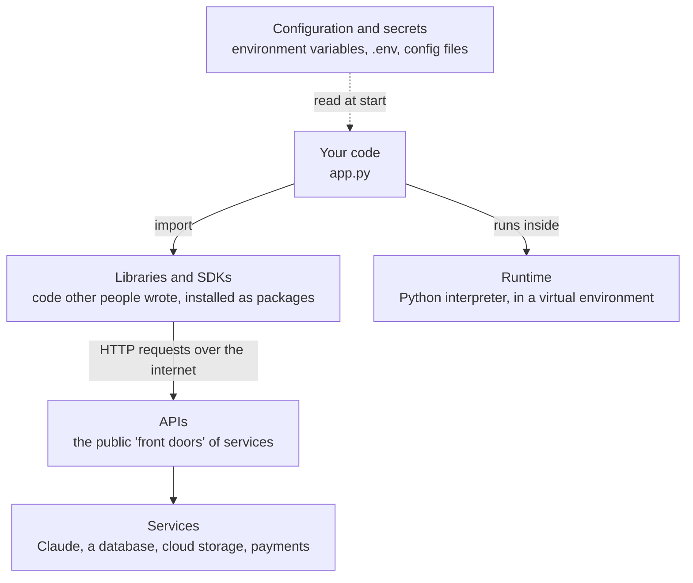

# 01 - Core Concepts: Code, Packages, APIs and SDKs

<!-- nav:start -->
**Previous:** [00 - Big Picture: How Everything Connects](00_big-picture.md) | **Index:** [All guides](../README.md) | **Next:** [02 - Markdown](02_markdown.md)
<!-- nav:end -->

The basic ideas every other guide assumes you already know, explained from zero: how code runs, what the terminal is, libraries, packages and dependencies, frameworks, APIs, SDKs (in depth: what they are, why they exist and how to use any SDK), configuration and secrets, and where code runs. Read this first if words like "SDK", "dependency" or "endpoint" feel fuzzy.

> **Last verified:** 2026-09-28. For newer changes, check the Official docs links in the Introduction.

## Introduction

### What is this guide?

Software tutorials are full of words that are rarely explained: *install the SDK*, *add the dependency*, *call the endpoint*, *set the environment variable*, *the framework handles routing*. When you are new, each of these feels like a small wall. This guide explains those words one by one, in plain language, with the **reason** each idea exists. The later guides then build on them.

You do not need to memorise everything here. Read it once, then come back when a word in another guide is unclear. Every section ends by pointing to the guide that goes deeper.

### Mental model

Almost every program you will write is **your code standing on top of other people's code**, talking to **other programs** through agreed interfaces:



```text
You write:        app.py                 (a few hundred lines: your idea)
You import:       anthropic, fastapi     (thousands of lines: other people's work, as packages)
They call:        https://api.anthropic.com/v1/messages   (an API: a contract between programs)
Which runs:       the actual service on someone else's computers
You configure:    ANTHROPIC_API_KEY=...  (settings and secrets, kept out of the code)
```

Three ideas carry most of the weight:

1. **Reuse**: nobody writes everything. You install packages (libraries, SDKs, frameworks) and build on them.
2. **Contracts**: programs talk through APIs, agreed formats for requests and responses, so neither side needs to know how the other works inside.
3. **Separation of code and configuration**: the same code runs on your laptop and in the cloud; only settings and secrets change.

### Why learn this first?

- **Error messages make sense**: `ModuleNotFoundError`, `401 Unauthorized` or `command not found` each point to one of the concepts below.
- **Documentation becomes readable**: docs assume these words; once you know them you can learn any new tool from its docs alone.
- **You choose better tools**: knowing the difference between a library, a framework and an SDK helps you pick the right one and understand what it does for you.
- **Everything else in this pocket guide builds on it.**

### Key terms

| Term | Meaning |
|---|---|
| Source code | The text files you write (`app.py`) that describe what a program should do |
| Interpreter | A program that reads source code and runs it line by line (`python` is the Python interpreter) |
| Runtime | Everything a program needs while it runs: the interpreter, installed packages, environment variables |
| Terminal / shell | A text window where you type commands to run programs |
| CLI | Command-line interface: a program you use by typing commands and flags (`git`, `uv`, `docker`) |
| Module | One Python file you can import |
| Package | A bundle of modules with a name and version, installed with a package manager (`requests`, `anthropic`) |
| Library | Reusable code you call from your program to do one job (HTTP, dates, math) |
| Standard library | The modules that come with Python itself (`json`, `pathlib`, `datetime`) |
| Dependency | A package your project needs in order to run |
| Package manager | A tool that downloads and installs packages and their dependencies (`uv`, `pip`, `npm`) |
| Package index / registry | The online store of packages (PyPI for Python, npm for JavaScript) |
| Version / semantic versioning | A package's release number, `MAJOR.MINOR.PATCH`; a MAJOR change may break your code |
| Lock file | A file recording the exact version of every installed package (`uv.lock`), so installs are repeatable |
| Virtual environment | A private folder of packages for one project, so projects do not conflict |
| Framework | A larger structure that calls *your* code at the right moments (FastAPI, React, pytest) |
| API | Application programming interface: the agreed way one program asks another to do something |
| Web API | An API reached over HTTP, usually with JSON requests and responses |
| Endpoint | One URL + method of a web API, e.g. `POST /v1/messages` |
| Request / response | The message you send to an API and the message it sends back |
| JSON | The text format most web APIs use for data (`{"name": "Ada", "age": 36}`) |
| SDK | Software development kit: the official package that makes an API easy to use from one language |
| Client | The object (or program) that sends requests; in SDKs, `client = anthropic.Anthropic()` |
| Server | The program that receives requests and answers them |
| API key | A secret string that proves who you are to an API (and who pays) |
| Environment variable | A named setting given to a program by the operating system (`ANTHROPIC_API_KEY`) |
| Exception | Python's way of signalling an error; it stops the program unless your code handles it |
| Localhost | "This computer"; `http://localhost:8000` is a server running on your own machine |
| Container | A packaged, isolated copy of an app with everything it needs to run (Docker) |

**Where it fits:** this is the vocabulary for everything else. [00 - Big Picture](00_big-picture.md) shows how the tools fit together; the next guides cover the terminal ([03](03_terminal-powershell.md)), Git ([05](05_git.md)), data formats ([08](08_yaml-json.md)) and HTTP ([09](09_http-apis.md)) in depth; Python itself starts at [10](10_python-basics.md); SDKs are used for real in [27 - LLM APIs](27_llm-apis.md).

### Official docs

Where to read more from the original sources:

| Resource | Link |
|---|---|
| Python glossary | https://docs.python.org/3/glossary.html |
| Python packaging glossary | https://packaging.python.org/en/latest/glossary/ |
| Python Package Index (PyPI) | https://pypi.org/ |
| Semantic versioning | https://semver.org/ |
| MDN: HTTP | https://developer.mozilla.org/en-US/docs/Web/HTTP |
| The Twelve-Factor App: config | https://12factor.net/config |
| Claude client SDKs | https://platform.claude.com/docs/en/api/client-sdks |
| Diataxis: kinds of documentation | https://diataxis.fr/ |

---

## Contents

1. [Code and How It Runs](#1-code-and-how-it-runs)
2. [The Terminal and Commands](#2-the-terminal-and-commands)
3. [Files, Folders and Paths](#3-files-folders-and-paths)
4. [Modules, Packages and Libraries](#4-modules-packages-and-libraries)
5. [Dependencies, Versions and Package Managers](#5-dependencies-versions-and-package-managers)
6. [Libraries vs Frameworks](#6-libraries-vs-frameworks)
7. [APIs: How Programs Talk to Each Other](#7-apis-how-programs-talk-to-each-other)
8. [SDKs: What They Are and Why They Exist](#8-sdks-what-they-are-and-why-they-exist)
9. [The Same Call Three Ways: curl, HTTP Library, SDK](#9-the-same-call-three-ways-curl-http-library-sdk)
10. [How to Use Any SDK, Step by Step](#10-how-to-use-any-sdk-step-by-step)
11. [Other Things Called "SDK"](#11-other-things-called-sdk)
12. [Configuration, Environment Variables and Secrets](#12-configuration-environment-variables-and-secrets)
13. [Where Code Runs: Processes, Servers, Containers, Cloud](#13-where-code-runs-processes-servers-containers-cloud)
14. [Reading Documentation and Error Messages](#14-reading-documentation-and-error-messages)
15. [Concept to Guide Map](#15-concept-to-guide-map)
16. [Troubleshooting](#16-troubleshooting)
17. [Try It](#17-try-it)

---

## 1. Code and How It Runs

> Source code is text; a program called an interpreter (for Python) reads that text and carries it out. The interpreter plus everything your program needs while running is called the runtime.
>
> Use it to understand what actually happens when you type `python app.py`, and why "which Python?" matters.

A computer's processor only understands very low-level instructions. People write in **programming languages** (Python, JavaScript, SQL) that are easier to read, and a program translates them:

| Approach | How it works | Examples |
|---|---|---|
| **Interpreted** | An interpreter reads your source code and runs it directly, every time | Python, JavaScript (Node.js), shell scripts |
| **Compiled** | A compiler translates the whole program once into a machine-code file you then run | C, Go, Rust |

When you run `python app.py`:

```text
1. The shell finds the program called "python" (a specific interpreter, e.g. Python 3.12)
2. The interpreter reads app.py from top to bottom
3. Each "import" loads another module: from the standard library, or from installed packages
4. Your code runs; print() writes to the terminal; errors stop it with a traceback
5. When the last line finishes (or an error is not handled), the program ends
```

**Why "which Python" matters:** a computer can have several Python interpreters (a system one, one from python.org, one managed by uv). Each has **its own installed packages**. Installing a package into one and running another is the most common beginner problem (section 16). Virtual environments and uv make this predictable ([11](11_python-virtual-environment.md), [12](12_uv.md)).

**Script vs module vs package:** a *script* is a file you run (`python app.py`); a *module* is a file you import (`import helpers`); a *package* is a folder of modules, or an installable bundle from PyPI.

Deeper: [10 - Python Basics](10_python-basics.md).

---

## 2. The Terminal and Commands

> The terminal is a text window where you run programs by typing commands. A command is a program name followed by arguments and flags that tell it what to do.
>
> Use it because most developer tools (Git, uv, Docker, cloud CLIs) are built to be used from the terminal, and commands can be copied, repeated and automated.

```text
uv  add  anthropic  --dev
|   |    |          |
|   |    |          +-- flag (option): changes how the command behaves
|   |    +------------- argument: what to act on
|   +------------------ subcommand: which action
+---------------------- program name (a CLI tool)
```

| Word | Meaning |
|---|---|
| Terminal | The window (Windows Terminal, macOS Terminal, VS Code's terminal panel) |
| Shell | The program inside it that reads your commands (PowerShell, bash, zsh) |
| Command | One line you type and run |
| CLI tool | A program designed to be used through commands (`git`, `uv`, `docker`, `az`) |
| Flag / option | `-v`, `--verbose`, `--output json`: settings for one command |
| PATH | The list of folders the shell searches to find programs; "command not found" usually means the program is not on PATH |
| Exit code | A number a command returns when it ends: 0 = success, anything else = failure |

**Why developers use it:** it is precise (a command does exactly one thing), repeatable (the same command works tomorrow and in CI), shareable (you can paste it into docs) and scriptable (put commands in a file and run them all).

Deeper: [03 - Terminal and PowerShell](03_terminal-powershell.md), [04 - Linux](04_linux.md).

---

## 3. Files, Folders and Paths

> A path is the address of a file or folder. Programs find files by path, either from the root of the disk (absolute) or from the folder they are running in (relative).
>
> Use it when a program says "file not found" and you need to know where it was looking.

| Kind | Windows example | macOS / Linux example |
|---|---|---|
| Absolute path | `C:\Users\ada\project\data.csv` | `/home/ada/project/data.csv` |
| Relative path | `data\data.csv` | `data/data.csv` |
| Current folder | `.` | `.` |
| Parent folder | `..` | `..` |
| Home folder | `~` (PowerShell) or `%USERPROFILE%` | `~` |

The **working directory** (current folder) is where relative paths start. `python app.py` run from the wrong folder cannot find `data/data.csv`, even though the file exists. `pwd` (or `Get-Location`) shows where you are; `cd` moves.

A **project folder** holds everything for one project: code, config, tests, a README, and (hidden) the virtual environment and Git history. Tools look for marker files in it: `pyproject.toml` (Python project), `package.json` (JavaScript), `.git/` (Git repository).

Deeper: [03 - Terminal and PowerShell](03_terminal-powershell.md), [50 - Project Structure](50_project-structure.md).

---

## 4. Modules, Packages and Libraries

> Code is shared as modules (single files), packages (bundles of modules with a name and version) and libraries (packages you call to do a job). You get them with `import` after installing them.
>
> Use it every time you think "someone must have solved this already": they usually have, and it is on PyPI.

```python
import json                      # standard library: comes with Python, nothing to install
from pathlib import Path         # standard library

import httpx                     # third-party package: must be installed first (uv add httpx)
from anthropic import Anthropic  # third-party package (an SDK, section 8)

from myapp.helpers import clean  # your own module, in your project
```

| Kind | Where it comes from | Install needed? |
|---|---|---|
| Standard library | Ships with Python (`json`, `csv`, `datetime`, `pathlib`, `logging`) | No |
| Third-party package | Downloaded from PyPI (`httpx`, `pandas`, `fastapi`, `anthropic`) | Yes: `uv add <name>` |
| Your own modules | Files in your project | No, but they must be importable (right folder / installed project) |

**Why reuse matters:** a package like `httpx` contains years of fixes for edge cases you would never think of (timeouts, encodings, proxies, security). Using it makes your code shorter and more correct. The trade-off: you now depend on someone else's code, so choose well-known, maintained packages and keep them updated.

**Choosing a package:** prefer the official one (from the company or project itself), check recent releases and downloads on PyPI, read the README, and look at open issues. Be careful with typos: attackers publish look-alike names (`reqeusts`) hoping you install the wrong one.

Deeper: [10 - Python Basics](10_python-basics.md), [12 - uv](12_uv.md).

---

## 5. Dependencies, Versions and Package Managers

> Your project's dependencies are the packages it needs. A package manager installs them (and *their* dependencies), records exact versions in a lock file and keeps each project's packages separate in a virtual environment.
>
> Use it when starting any project, adding a package, or when "it works on my machine" but not on someone else's.

**The problem package managers solve:** `anthropic` needs `httpx`, which needs `certifi` and more. Installing by hand would mean finding and matching dozens of packages and versions. A package manager resolves this whole **dependency tree** for you.

```text
your project
  +-- anthropic 1.8.0
  |     +-- httpx 0.28.1
  |     |     +-- certifi, idna, ...
  |     +-- pydantic 2.x
  +-- fastapi 0.115.x
        +-- starlette, pydantic, ...
```

| Piece | What it is | Python (uv) | JavaScript (npm) |
|---|---|---|---|
| Declared dependencies | What you asked for, with allowed ranges | `pyproject.toml` | `package.json` |
| Lock file | Exact versions actually installed | `uv.lock` | `package-lock.json` |
| Install location | Per-project folder | `.venv/` | `node_modules/` |
| Add a package | Command | `uv add httpx` | `npm install react` |
| Install everything | Command | `uv sync` | `npm ci` |

**Versions** follow semantic versioning, `MAJOR.MINOR.PATCH`:

| Change | Example | Meaning for you |
|---|---|---|
| PATCH | 1.8.0 -> 1.8.1 | Bug fixes; safe |
| MINOR | 1.8.1 -> 1.9.0 | New features; should be safe |
| MAJOR | 1.9.0 -> 2.0.0 | Breaking changes possible; read the changelog before upgrading |

**Why a virtual environment:** project A needs `pandas 1.x`, project B needs `pandas 2.x`. One shared install cannot satisfy both. Each project gets its own `.venv` folder with its own packages, so they never collide.

**Why a lock file:** `httpx>=0.27` allows many versions. Without a lock file, you and a colleague (or your server) might install different ones and see different behaviour. The lock file pins the exact versions, so every install is identical. Commit it to Git.

Deeper: [11 - Virtual Environments](11_python-virtual-environment.md), [12 - uv](12_uv.md).

---

## 6. Libraries vs Frameworks

> You call a library when you need it; a framework calls your code when it needs it. Frameworks give you a structure to fill in and handle the plumbing around it.
>
> Use it to understand why FastAPI code looks like "decorated functions that nobody calls", and to choose between a small library and a full framework.

```python
# Library: YOU are in control. You call httpx when you decide to.
import httpx
response = httpx.get("https://example.com")

# Framework: FASTAPI is in control. It calls your function when a request for /hello arrives.
from fastapi import FastAPI
app = FastAPI()

@app.get("/hello")
def hello():
    return {"message": "hi"}
```

| | Library | Framework |
|---|---|---|
| Who is in charge | Your code | The framework ("inversion of control") |
| Size | Usually does one job | Structures a whole application |
| You provide | Calls to its functions | Functions / classes it will call, following its rules |
| Examples | `httpx`, `pandas`, `numpy`, `anthropic` | FastAPI, Django, React, pytest, LangGraph |
| Trade-off | Flexible, you write more glue | Less glue, but you follow its way of doing things |

**Where SDKs fit:** an SDK is usually a *library* (you call it). Some products called SDKs are closer to frameworks, for example agent SDKs that run a loop and call your tools (section 11).

Deeper: [40 - FastAPI](40_fastapi.md), [15 - pytest](15_pytest.md), [33 - Agent Frameworks](33_agent-frameworks.md).

---

## 7. APIs: How Programs Talk to Each Other

> An API is a contract: "send me a request in this exact shape and I will send back a response in that shape". The caller does not need to know how the other side works inside. Web APIs use HTTP over the network, usually with JSON.
>
> Use it whenever your code needs something another system has: a model's answer, a database row, a payment, a file in cloud storage.

**Background:** "API" is a broad word. Any agreed way to use a piece of software is an API:

| Kind of API | What the contract looks like | Example |
|---|---|---|
| Function / library API | Function names, parameters, return values | `json.dumps(data, indent=2)` |
| Operating system API | System calls for files, network, processes | Opening a file |
| Command-line interface | Commands and flags | `git commit -m "msg"` |
| **Web API** | HTTP method + URL + headers + JSON body | `POST https://api.anthropic.com/v1/messages` |

In daily conversation, "the API" almost always means a **web API**. One web API call looks like this:

```text
REQUEST (your program -> the service)
  POST https://api.anthropic.com/v1/messages        method + URL (the endpoint)
  x-api-key: sk-ant-...                             header: who you are
  content-type: application/json                    header: body format
  {"model": "claude-opus-5", "max_tokens": 1024,     body: what you want
   "messages": [{"role": "user", "content": "Hi"}]}

RESPONSE (the service -> your program)
  200 OK                                            status code: it worked
  {"content": [{"type": "text", "text": "Hello!"}], body: the result
   "usage": {"input_tokens": 8, "output_tokens": 5}}
```

| Word | Meaning |
|---|---|
| Base URL | The address all endpoints start with (`https://api.anthropic.com`) |
| Endpoint | One path + method (`POST /v1/messages`) = one action |
| Method | `GET` read, `POST` create / do, `PUT`/`PATCH` update, `DELETE` remove |
| Header | Extra information about the request (authentication, format, version) |
| Body | The data you send (usually JSON) |
| Status code | `2xx` success, `4xx` your mistake (401 bad key, 404 not found, 429 too many requests), `5xx` their problem |
| Authentication | Proving who you are, usually an API key or token in a header |
| Rate limit | How many requests you may send per minute |
| API reference | The documentation listing every endpoint, parameter and response field |

**Why APIs are designed this way:** the service can change its internals (new servers, new databases) without breaking you, as long as the contract stays the same. You can call it from any language, because HTTP and JSON work everywhere. And the provider can control access (keys), usage (rate limits) and billing.

Deeper: [09 - HTTP and APIs](09_http-apis.md), [08 - YAML and JSON](08_yaml-json.md).

---

## 8. SDKs: What They Are and Why They Exist

> An SDK (software development kit) is a package, usually from the company that runs an API, that lets you use that API from one programming language as normal functions and objects. It builds the HTTP requests, handles keys, retries, errors and streaming, and gives you typed results.
>
> Use it as your default way to talk to a service that offers one (Claude, OpenAI, AWS, Azure, Stripe, GitHub), instead of writing raw HTTP requests yourself.

**Background:** the web API from section 7 works from any language, but every caller would have to write the same boring and error-prone code: build URLs, add headers, turn Python data into JSON, check status codes, retry when the service is busy, parse the response, handle streaming. An SDK is that code, written once by the provider, tested, and published as a package for each popular language.

```text
Without an SDK                                  With an SDK
--------------                                  -----------
build URL + headers + JSON body                 client.messages.create(model=..., messages=...)
send with an HTTP library
check the status code, raise on errors          raises anthropic.RateLimitError etc.
retry on 429 / 5xx with backoff                 automatic (max_retries)
parse JSON into dicts                           typed objects: response.content[0].text
handle streaming events line by line            with client.messages.stream(...) as stream
```

### What is inside a typical SDK

| Part | What it does for you |
|---|---|
| Client class | One object holding your key, base URL, timeouts and retry settings (`anthropic.Anthropic()`) |
| Methods per endpoint | `client.messages.create(...)`, `client.messages.batches.list()`: one method per API action, named like the docs |
| Authentication | Reads the API key from an environment variable automatically |
| Types / models | Python classes for requests and responses, so your editor autocompletes fields and catches typos |
| Error classes | One exception class per kind of failure (`AuthenticationError`, `RateLimitError`, `APIConnectionError`) |
| Retries and timeouts | Sensible defaults for transient failures |
| Helpers | Streaming, pagination (fetching page after page), file uploads, tool runners |
| Sync and async clients | `Anthropic()` and `AsyncAnthropic()` for normal and `async` code |
| Docs and examples | README, API reference, example scripts, changelog |

**API vs SDK in one sentence:** the API is the service's front door (the contract, reachable over HTTP from anywhere); the SDK is a convenient key for that door, made for one language.

**Official vs community SDKs:** official SDKs are published by the provider (the `anthropic` package on PyPI for Python, `@anthropic-ai/sdk` on npm for TypeScript) and follow the API closely. Community SDKs exist for languages the provider does not cover; they can be good, but may lag behind or be unmaintained. Prefer official ones.

### Well-known SDKs

| Service | Python package | Client example |
|---|---|---|
| Claude (Anthropic) | `anthropic` | `anthropic.Anthropic()` |
| OpenAI | `openai` | `openai.OpenAI()` |
| AWS | `boto3` | `boto3.client("s3")` |
| Azure | `azure-*` (for example `azure-storage-blob`, `azure-identity`) | `BlobServiceClient(...)` |
| Google Cloud | `google-cloud-*` (for example `google-cloud-storage`) | `storage.Client()` |
| GitHub | `PyGithub` (community) | `Github(auth=...)` |
| Stripe | `stripe` | `stripe.StripeClient(...)` |
| Hugging Face Hub | `huggingface_hub` | `HfApi()` |

**When not to use an SDK:** when there is no SDK for your language, when you need an API feature the SDK does not support yet, when a tiny script must avoid dependencies, or when you are debugging and want to see the raw HTTP. Then call the API directly (section 9).

---

## 9. The Same Call Three Ways: curl, HTTP Library, SDK

> One request to the Claude API written three ways. All three send exactly the same HTTP request; they differ in how much work you do yourself.
>
> Use it to see what an SDK actually saves you, and to debug: if the SDK call fails, trying the raw request shows whether the problem is your code or the API call itself.

### 1. curl (command line, raw HTTP)

```bash
curl https://api.anthropic.com/v1/messages \
  -H "x-api-key: $ANTHROPIC_API_KEY" \
  -H "anthropic-version: 2023-06-01" \
  -H "content-type: application/json" \
  -d '{"model": "claude-opus-5", "max_tokens": 1024,
       "messages": [{"role": "user", "content": "Explain an SDK in one sentence."}]}'
```

### 2. Python with an HTTP library (raw HTTP, by hand)

```python
import os

import httpx

response = httpx.post(
    "https://api.anthropic.com/v1/messages",
    headers={
        "x-api-key": os.environ["ANTHROPIC_API_KEY"],   # you read the key yourself
        "anthropic-version": "2023-06-01",              # you must know the required headers
        "content-type": "application/json",
    },
    json={
        "model": "claude-opus-5",
        "max_tokens": 1024,
        "messages": [{"role": "user", "content": "Explain an SDK in one sentence."}],
    },
    timeout=60,                                          # you choose timeouts
)
response.raise_for_status()                              # you check errors (and retry yourself)
data = response.json()                                   # plain dicts: no autocomplete, typos fail at runtime
print(data["content"][0]["text"])
```

### 3. Python with the SDK

```python
import anthropic

client = anthropic.Anthropic()        # reads ANTHROPIC_API_KEY, sets headers, timeouts and retries

response = client.messages.create(
    model="claude-opus-5",
    max_tokens=1024,
    messages=[{"role": "user", "content": "Explain an SDK in one sentence."}],
)
print(response.content[0].text)       # typed object: your editor knows the fields
```

| Concern | curl | HTTP library | SDK |
|---|---|---|---|
| Headers, URL, API version | You | You | Automatic |
| Reading the API key | You | You | Automatic (environment variable) |
| Errors | Read the output | Check status codes yourself | Specific exception classes |
| Retries on overload / rate limits | No | Write it yourself | Built in |
| Response | Raw JSON text | Dicts | Typed objects with autocomplete |
| Streaming | Raw event lines | Parse events yourself | `client.messages.stream(...)` helper |
| Best for | Quick tests, debugging | No SDK available, unusual needs | Normal application code |

---

## 10. How to Use Any SDK, Step by Step

> Every SDK follows the same pattern: install the package, provide credentials, create a client, call methods, read the result, handle errors. Learn the pattern once and you can pick up any new SDK from its docs.
>
> Use it the first time you work with a new service, whether it is Claude, AWS, Azure or anything else.

### Step 1: Find the official SDK

Search the provider's docs for "SDKs", "client libraries" or "Python library". Check the package name on PyPI (the docs will state it exactly) and that it is published by the provider.

### Step 2: Install it into your project

```bash
uv add anthropic                 # adds to pyproject.toml, updates uv.lock, installs into .venv
# or, in a plain virtual environment:
pip install anthropic
```

### Step 3: Provide credentials (never in the code)

```powershell
$env:ANTHROPIC_API_KEY = "sk-ant-..."        # Windows PowerShell, this terminal only
```

```bash
export ANTHROPIC_API_KEY="sk-ant-..."        # macOS / Linux, this terminal only
```

For projects, put it in a `.env` file that is listed in `.gitignore`, and load it with your settings code ([08](08_yaml-json.md), [13 - Pydantic](13_pydantic.md)). Cloud SDKs often use other credential sources (a login with `az login` or `aws configure`, managed identities in the cloud); their docs have a "Authentication" page.

### Step 4: Create a client once and reuse it

```python
import anthropic

client = anthropic.Anthropic(
    timeout=60.0,        # optional: seconds before giving up on one request
    max_retries=2,       # optional: automatic retries on transient errors
)
```

Create the client once (at startup) and reuse it: it keeps network connections open, which is faster than creating a new client per request.

### Step 5: Call a method and read the result

Method names mirror the API reference: the endpoint `POST /v1/messages` becomes `client.messages.create(...)`, and its parameters become keyword arguments.

```python
response = client.messages.create(
    model="claude-opus-5",
    max_tokens=1024,
    messages=[{"role": "user", "content": "Name three uses of an SDK."}],
)
print(response.content[0].text)     # the answer
print(response.usage)               # tokens used (what you pay for)
print(response.model_dump_json(indent=2))   # everything, to explore the structure
```

**Tip:** when you do not know what an object contains, print it or use your editor's autocomplete (type `response.` and wait). SDK response objects are documented in the API reference under the same names.

### Step 6: Handle errors

```python
import anthropic

try:
    response = client.messages.create(model="claude-opus-5", max_tokens=1024, messages=messages)
except anthropic.AuthenticationError:
    print("Check ANTHROPIC_API_KEY")                 # 401: wrong or missing key
except anthropic.RateLimitError:
    print("Too many requests; slow down")           # 429, after the SDK's own retries
except anthropic.APIConnectionError:
    print("Network problem")                        # no connection, DNS, timeout
except anthropic.APIStatusError as error:
    print(f"API error {error.status_code}")         # any other non-2xx answer
```

Catch the specific errors you can do something about; let unexpected ones stop the program with a clear traceback.

### Step 7: Learn the rest from the docs

| Doc page | What to look for |
|---|---|
| Quickstart | The first working call; copy it and change one thing at a time |
| API reference | Every method, parameter and response field |
| Authentication | How credentials are found (environment variables, config files, cloud identity) |
| Errors | Error classes and which ones are safe to retry |
| Changelog / release notes | What changed between versions (read before a MAJOR upgrade) |
| GitHub repository | README, examples folder, open issues (someone probably had your problem) |

### The same pattern in other SDKs

```python
# AWS: list your S3 buckets (credentials from `aws configure` or environment variables)
import boto3
s3 = boto3.client("s3")
for bucket in s3.list_buckets()["Buckets"]:
    print(bucket["Name"])

# Azure: list blobs in a storage container (credentials from `az login` or a managed identity)
from azure.identity import DefaultAzureCredential
from azure.storage.blob import BlobServiceClient
service = BlobServiceClient("https://<account>.blob.core.windows.net", credential=DefaultAzureCredential())
for blob in service.get_container_client("data").list_blobs():
    print(blob.name)
```

Install, authenticate, create a client, call methods, read results, handle errors: the steps never change, only the names do.

---

## 11. Other Things Called "SDK"

> "SDK" is used loosely. Besides API client libraries, it can mean a full toolkit for building on a platform, including agent runtimes, command-line tools and emulators.
>
> Use it to avoid confusion when two things with "SDK" in their name do very different jobs.

| Name | What it actually is | Library or framework? |
|---|---|---|
| Anthropic Python SDK (`anthropic`) | Client library for the Claude API | Library: you call it |
| Claude Agent SDK | A runtime that runs an agent loop with built-in tools; you configure it and it calls your tools | Closer to a framework |
| OpenAI Agents SDK | A framework for building multi-step agents on OpenAI models | Framework |
| AWS SDK (`boto3`), Azure SDK | Client libraries for hundreds of cloud services | Library |
| Android SDK, iOS SDK | Everything to build mobile apps: compilers, emulators, libraries, tools | Toolkit / platform |
| MCP SDK (`mcp`) | Library to build servers and clients for the Model Context Protocol | Library with framework parts |

**CLI vs SDK:** many providers offer both. The CLI (`az`, `aws`, `gh`) is for humans typing commands and for scripts; the SDK is for code inside your application. Under the hood both call the same web API.

Deeper: [33 - Agent Frameworks](33_agent-frameworks.md), [34 - MCP](34_mcp.md), [48 - Azure](48_azure.md).

---

## 12. Configuration, Environment Variables and Secrets

> Configuration is everything that changes between environments (your laptop, tests, production): URLs, model names, log levels and secrets such as API keys. It lives outside the code, mostly in environment variables.
>
> Use it so the same code runs everywhere and secrets never end up in Git.

An **environment variable** is a named text value the operating system hands to every program it starts. Programs read them at startup:

```python
import os

api_key = os.environ["ANTHROPIC_API_KEY"]            # required: fails clearly if missing
log_level = os.environ.get("LOG_LEVEL", "INFO")      # optional, with a default
```

| Where configuration lives | Good for | Commit to Git? |
|---|---|---|
| Defaults in code | Safe values for local development | Yes |
| Environment variables | Everything that differs per environment | They are not files |
| `.env` file | Local environment variables, loaded by your tools | **No** (add to `.gitignore`) |
| `.env.example` | The list of variable names with fake values | Yes |
| Config files (YAML, TOML, JSON) | Larger, non-secret settings | Yes |
| Secret store (Key Vault, GitHub secrets) | Production secrets | No, managed by the platform |

**Why secrets never go in code:** Git remembers everything forever. A key committed once, even if deleted in the next commit, can be found and misused, and bots scan public repositories for keys within minutes. If it happens: revoke the key in the provider's console immediately and create a new one.

Deeper: [08 - YAML, JSON, TOML and .env](08_yaml-json.md), [13 - Pydantic](13_pydantic.md) (settings classes).

---

## 13. Where Code Runs: Processes, Servers, Containers, Cloud

> A running program is a process. A server is a process that waits for requests on a port. Containers package a program with everything it needs so it runs the same anywhere; the cloud rents you computers and managed services to run it on.
>
> Use it to understand what "run the server", "localhost:8000", "build the image" and "deploy" mean.

| Word | Meaning |
|---|---|
| Process | One running program; it has memory, a working directory and environment variables |
| Server | A process that listens for requests (a web server, a database server) |
| Port | A numbered door on a computer; one server per port (`8000`, `5432` for Postgres) |
| Localhost | This computer; `127.0.0.1` |
| Container | An isolated package of an app plus its runtime and dependencies (Docker image -> running container) |
| Virtual machine (VM) | A whole simulated computer with its own operating system |
| Cloud | Computers and services you rent (Azure, AWS, Google Cloud), from raw VMs to fully managed services |
| Deploy | Put a new version of your app where users can reach it |

```text
Your laptop                                   The cloud
-----------                                   ---------
uvicorn app:app --port 8000                   the same app in a container
  -> a process listening on localhost:8000      -> behind HTTPS on https://api.example.com
browser -> http://localhost:8000/docs         users -> the internet -> load balancer -> containers
```

**Why containers:** "it works on my machine" happens because machines differ (Python version, packages, OS). A container image carries its own runtime and packages, so it behaves the same on your laptop, in CI and in the cloud.

Deeper: [41 - Uvicorn](41_uvicorn.md), [43 - Docker](43_docker.md), [48 - Azure](48_azure.md).

---

## 14. Reading Documentation and Error Messages

> Two skills that make you independent: finding the right kind of documentation page, and reading an error message from the bottom up.
>
> Use it whenever you are stuck, before searching the web or asking someone.

### Kinds of documentation

Most good docs are organised this way:

| Kind | Answers | Read it when |
|---|---|---|
| Tutorial / quickstart | "Show me the basics, step by step" | You are new to the tool |
| How-to guide | "How do I do X?" | You have a specific task |
| Reference | "What exactly does this parameter do?" | You need precise details |
| Explanation / concepts | "Why does it work this way?" | You want to understand the design |

**Reading a Python traceback:** start at the **last line** (what went wrong), then look upward for the **last line that points into your own file** (where it went wrong).

```text
Traceback (most recent call last):
  File "C:\project\app.py", line 12, in <module>          <- your code: the line that started it
    answer = ask(question)
  File "C:\project\app.py", line 7, in ask
    response = client.messages.create(model=MODEL, ...)   <- your code: the call that failed
  File ".venv\Lib\site-packages\anthropic\...", line 1044, in request
    raise self._make_status_error_from_response(err.response) from None
anthropic.AuthenticationError: Error code: 401 - invalid x-api-key   <- WHAT went wrong
```

Here: the SDK reached the API, and the API rejected the key (401). The fix is the key, not the code.

**A debugging routine:** read the last line; find your line; check the input values (print them); reproduce with the smallest example; search the exact error message plus the package name; check the package's GitHub issues.

Deeper: [10 - Python Basics](10_python-basics.md) (exceptions), [06 - VS Code](06_vscode.md) (debugger).

---

## 15. Concept to Guide Map

> Where each concept from this guide is covered in depth.
>
> Use it to decide what to read next.

| Concept | Guide |
|---|---|
| The big picture: how all tools connect | [00 - Big Picture](00_big-picture.md) |
| Terminal, commands, paths | [03 - Terminal and PowerShell](03_terminal-powershell.md), [04 - Linux](04_linux.md) |
| Version control (saving history of code) | [05 - Git and GitHub](05_git.md) |
| Editor and debugger | [06 - VS Code](06_vscode.md) |
| JSON, YAML, TOML, `.env` | [08 - YAML, JSON, TOML and .env](08_yaml-json.md) |
| HTTP and web APIs | [09 - HTTP and APIs](09_http-apis.md) |
| Python language | [10 - Python Basics](10_python-basics.md) |
| Virtual environments, packages, lock files | [11 - Virtual Environments](11_python-virtual-environment.md), [12 - uv](12_uv.md) |
| Settings and validation | [13 - Pydantic](13_pydantic.md) |
| Using an SDK for real (Claude) | [27 - LLM APIs](27_llm-apis.md) |
| Building your own API | [40 - FastAPI](40_fastapi.md) |
| Containers | [43 - Docker](43_docker.md) |
| Cloud | [48 - Azure](48_azure.md) |

---

## 16. Troubleshooting

> The errors beginners meet most, what they mean in terms of the concepts above, and what to do.
>
> Use it when something fails before your own code even gets going.

| Error | What it means | Fix |
|---|---|---|
| `command not found` / `is not recognized` | The shell cannot find the program on PATH | Install it, restart the terminal, or check the spelling |
| `ModuleNotFoundError: No module named 'anthropic'` | The package is not installed in the Python that is running | `uv add anthropic` and run with `uv run python app.py`; or activate the right `.venv` |
| `FileNotFoundError` | A relative path starts from a different working directory | `pwd` to see where you are; use paths relative to the project or `Path(__file__).parent` |
| `KeyError: 'ANTHROPIC_API_KEY'` | The environment variable is not set in this terminal | Set it (section 10 step 3) or load your `.env` |
| `401 Unauthorized` / `AuthenticationError` | The API rejected the key | Check for typos, extra spaces, a revoked key, or the wrong account |
| `429 Too Many Requests` / `RateLimitError` | You are over the rate limit | Slow down, add retries with waiting, or batch the work |
| `ImportError` or `AttributeError` after an upgrade | A MAJOR version changed the API of a package | Read the changelog; pin the old version until you update your code |
| Works on your machine, fails elsewhere | Different Python, packages or settings | Commit the lock file, use `uv sync`, list settings in `.env.example`, consider a container |
| `Address already in use` | Another process uses that port | Stop it, or pick another port (`--port 8001`) |

---

## 17. Try It

> Short exercises to check the ideas in this guide. Try each one before opening the solution.
>
> Use it to make sure the vocabulary really makes sense to you.

### Exercise 1: Library or framework?

For each, say whether it is mainly a library or a framework, and why: `httpx`, FastAPI, `pandas`, pytest.

<details markdown="1">
<summary>Solution</summary>

`httpx`: library (you call `httpx.get` when you choose). FastAPI: framework (it calls your route functions when requests arrive). `pandas`: library (you call its functions on your data). pytest: framework (it finds and calls your `test_*` functions).

</details>

### Exercise 2: Take a request apart

In `POST https://api.anthropic.com/v1/messages` with header `x-api-key` and a JSON body, name the method, base URL, endpoint path, authentication and body.

<details markdown="1">
<summary>Solution</summary>

Method `POST`; base URL `https://api.anthropic.com`; endpoint path `/v1/messages`; authentication: the API key in the `x-api-key` header; body: the JSON with `model`, `max_tokens` and `messages`.

</details>

### Exercise 3: What does the SDK do?

List four things `client.messages.create(...)` does for you that you would otherwise write yourself with `httpx`.

<details markdown="1">
<summary>Solution</summary>

Any four of: reads the API key from the environment; sets the URL and required headers (including the API version); converts arguments to JSON; checks the status code and raises a specific exception; retries on rate limits and server errors; applies a timeout; turns the JSON response into typed objects; provides streaming helpers.

</details>

### Exercise 4: Read the error

A script fails with `ModuleNotFoundError: No module named 'httpx'`, but you are sure you ran `pip install httpx`. What is the most likely cause?

<details markdown="1">
<summary>Solution</summary>

`pip` installed `httpx` into a different Python interpreter (or a different virtual environment) than the one running the script. Check with `python -c "import sys; print(sys.executable)"`, activate the project's `.venv`, or use `uv add httpx` and `uv run python script.py`, which always use the project's environment.

</details>

### Exercise 5: Where does the setting go?

Where should each of these live: the Claude API key, the model name, the default page size of 50, the list of required variables for new team members?

<details markdown="1">
<summary>Solution</summary>

API key: environment variable (locally from a git-ignored `.env`, in production from a secret store). Model name: environment variable with a default in code, so it can change per environment. Page size 50: a named constant or default in code. The list of required variables: `.env.example`, committed to Git.

</details>

---

<!-- nav:start -->
**Previous:** [00 - Big Picture: How Everything Connects](00_big-picture.md) | **Index:** [All guides](../README.md) | **Next:** [02 - Markdown](02_markdown.md)
<!-- nav:end -->
