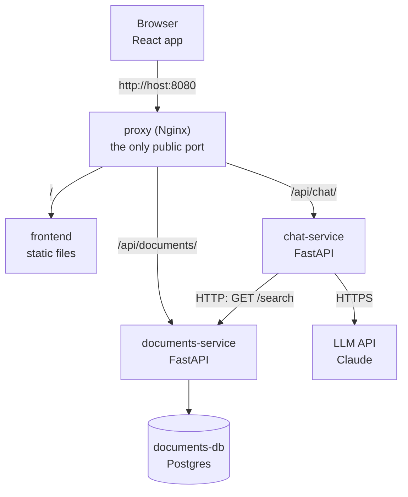

# 49 - Project Structure: Python Microservices + Frontend

<!-- nav:start -->
**Previous:** [48 - Azure VM + Linux + Ollama](48_azure-vm-ollama.md) | **Index:** [All guides](../README.md) | **Next:** [50 - Project Templates](50_project-templates.md)
<!-- nav:end -->

How to lay out one repository that holds several Python backend services, each in its own Docker container, plus a separate React frontend: folders, shared code, configuration, Compose, proxy, tests, CI and deployment. Comes with a runnable starter in `templates/fullstack-microservices/`.

> **Last verified:** 2026-09-28. For newer changes, check the Official docs links in the Introduction.

## Introduction

### What is a project structure and why does it matter?

The **project structure** is where each piece of code, configuration and infrastructure lives. For one small script it hardly matters. For a system with several services, a frontend, databases and Docker, a clear structure decides whether a new team member finds things in minutes or days, whether one service can be changed and deployed without touching the others, and whether Docker builds stay fast.

This guide recommends a **monorepo** (one Git repository) with **one folder per deployable unit**: each backend service, the frontend and the proxy. Shared Python code lives in `libs/`, and a **uv workspace** keeps one lock file for all Python services. Every service is its own FastAPI app, its own Docker image and owns its own database.

### Mental model

Think of each service as a small shop with its own storeroom (database) and its own shop window (HTTP API). Shops never walk into each other's storerooms; they ask at the window. The proxy is the shopping centre entrance: customers (the browser) come in through one door and are sent to the right shop.



```text
Repository                          Running system (docker compose up)
----------                          ----------------------------------
services/documents-service/  --->   documents-service container + documents-db container
services/chat-service/       --->   chat-service container
frontend/                    --->   frontend container (Nginx serving the built React app)
proxy/nginx.conf             --->   proxy container, port 8080, routes by URL path
libs/common/                 --->   copied INTO each service image (not a container)
compose.yaml                 --->   wires the containers together on one private network
```

### Why use this structure?

- **Independent services**: change, test, build and deploy one service without rebuilding the others.
- **Clear ownership**: each folder is one team's or one feature's responsibility; each database belongs to one service.
- **Fast, small images**: each Dockerfile copies only its own service and the shared library.
- **One set of versions**: the uv workspace gives every Python service the same locked dependency versions.
- **No CORS headaches**: the browser sees one origin; the proxy sends `/api/...` to the right service.
- **Same shape everywhere**: the folders map directly onto Compose locally and Container Apps or Kubernetes in the cloud.

### Key terms

| Term | Meaning |
|---|---|
| Monorepo | One Git repository containing several services and apps |
| Microservice | A small, separately deployable service that owns one business capability and its data |
| Modular monolith | One deployable app split internally into well separated modules; often the better first step |
| uv workspace | Several Python packages in one repository sharing one `uv.lock` and one virtual environment |
| Workspace member | One package inside a uv workspace (a service or a shared library) |
| Layered architecture | Splitting code into routes (HTTP), services (business logic) and repositories (data access) |
| Repository pattern | A class that hides database queries behind simple methods like `add` and `get` |
| API gateway | The single entry point that routes requests to services (here: the Nginx proxy) |
| Data ownership | Rule that only one service reads and writes a given database |
| Request ID | An ID attached to a request and passed between services so logs can be joined |
| Compose override file | A second Compose file whose settings are merged over the first (for example for development) |
| Build context | The folder Docker sends to the builder; files outside it cannot be copied into the image |

**Where it fits:** combines [39 - FastAPI](39_fastapi.md), [40 - Uvicorn](40_uvicorn.md), [11 - uv](11_uv.md), [12 - Pydantic](12_pydantic.md), [14 - pytest](14_pytest.md), [42 - Docker](42_docker.md), [44 - Nginx](44_nginx-https.md) and [43 - GitHub Actions](43_github-actions.md) into one project; deploy with [45 - Kubernetes](45_kubernetes.md), [46 - Terraform](46_terraform.md) or [47 - Azure](47_azure.md). A single-service version of the same ideas is the [97 - Capstone Project](97_capstone-project.md). To stamp out new services from this layout automatically, see [50 - Project Templates](50_project-templates.md).

### Official docs

Where to read the latest, authoritative documentation:

| Resource | Link |
|---|---|
| uv workspaces | https://docs.astral.sh/uv/concepts/projects/workspaces/ |
| uv in Docker | https://docs.astral.sh/uv/guides/integration/docker/ |
| FastAPI: bigger applications | https://fastapi.tiangolo.com/tutorial/bigger-applications/ |
| Docker Compose file reference | https://docs.docker.com/reference/compose-file/ |
| Compose: merging files | https://docs.docker.com/compose/how-tos/multiple-compose-files/merge/ |
| Vite: server proxy | https://vite.dev/config/server-options#server-proxy |
| nginx proxy module | https://nginx.org/en/docs/http/ngx_http_proxy_module.html |
| The Twelve-Factor App | https://12factor.net/ |
| Microservices patterns | https://microservices.io/patterns/ |

---

## Contents

0. [Flags and Parameters](#0-flags-and-parameters)
1. [Principles (and When Not to Use Microservices)](#1-principles-and-when-not-to-use-microservices)
2. [The Full Tree](#2-the-full-tree)
3. [Inside One Service](#3-inside-one-service)
4. [Shared Code with a uv Workspace](#4-shared-code-with-a-uv-workspace)
5. [Frontend Layout](#5-frontend-layout)
6. [Reverse Proxy (API Gateway)](#6-reverse-proxy-api-gateway)
7. [Configuration and Secrets](#7-configuration-and-secrets)
8. [Docker: One Image per Service](#8-docker-one-image-per-service)
9. [Compose for Development vs Production-like](#9-compose-for-development-vs-production-like)
10. [Service-to-Service Calls](#10-service-to-service-calls)
11. [Data Ownership](#11-data-ownership)
12. [Testing Strategy](#12-testing-strategy)
13. [CI per Service](#13-ci-per-service)
14. [Deployment Layout](#14-deployment-layout)
15. [Checklist](#15-checklist)
16. [Troubleshooting](#16-troubleshooting)
17. [Try It](#17-try-it)

---

## 0. Flags and Parameters

> The commands you run most in this layout: uv for the Python workspace, Docker Compose for the containers and npm for the frontend.
>
> Use this when you see `uv sync --package chat-service` or `docker compose -f compose.yaml -f compose.dev.yaml up --build` and want to know what each part does.

```text
docker  compose  -f compose.yaml  -f compose.dev.yaml  up  --build  -d
|       |        |                |                    |   |        |
|       |        |                |                    |   |        +-- -d: detached, run in the background
|       |        |                |                    |   +----------- rebuild images before starting
|       |        |                |                    +--------------- create and start the containers
|       |        |                +------------------------------------ second file: merged over the first
|       |        +----------------------------------------------------- first file: the base definition
|       +-------------------------------------------------------------- the Compose plugin
+---------------------------------------------------------------------- Docker CLI
```

| Command | Meaning |
|---|---|
| `uv sync --all-packages` | Install every workspace member and dev tools into one `.venv` (for local work and tests) |
| `uv sync --package chat-service` | Install only that member and its dependencies (used in its Dockerfile) |
| `uv sync --frozen` / `--locked` | Use `uv.lock` without updating it / fail if it is out of date |
| `uv sync --no-dev` | Skip development dependencies (pytest, ruff) |
| `uv sync --no-install-workspace` | Install third-party dependencies only, not our own packages (Docker caching trick) |
| `uv sync --no-editable` | Install our packages as normal copies, so the image does not need the source folders |
| `uv run --package documents-service <cmd>` | Run a command in the context of one member |
| `uv add --package chat-service httpx` | Add a dependency to one member |
| `uv lock` | Re-resolve and rewrite `uv.lock` (after adding a member or changing versions) |
| `docker compose config` | Print the merged, variable-substituted configuration (great for debugging) |
| `docker compose up --build <service>` | Rebuild and start one service (and what it depends on) |
| `docker compose logs -f chat-service` | Follow the logs of one service |
| `docker compose exec documents-db psql -U documents` | Open a shell / tool inside a running container |
| `docker compose down -v` | Stop everything and delete volumes (database data is lost) |
| `docker build -f services/chat-service/Dockerfile .` | Build one image; `-f` is the Dockerfile, `.` is the build context (repo root) |
| `npm ci` | Install exactly what `package-lock.json` says (CI and Docker) |
| `npm run dev` / `npm run build` | Vite dev server with hot reload / type-check and build static files into `dist/` |

---

## 1. Principles (and When Not to Use Microservices)

> The handful of rules the rest of this guide follows, and an honest word on when several services are worth the extra work.
>
> Use it before you start a new project, to decide between one service and several.

**Start with a modular monolith unless you have a reason not to.** Several services add network calls, more Docker images, more deployments and harder debugging. One FastAPI app with well separated modules (`documents/`, `chat/`) is simpler and can be split later if the boundaries are clean.

Several services are worth it when:

- parts need to **scale differently** (the chat part needs 10 replicas, the documents part needs 1),
- parts have **different runtimes or resources** (one needs a GPU, one is a scheduled job),
- **different teams** own different parts and want to deploy independently,
- a failure or slow response in one part must **not take down** the others.

The rules this layout follows:

| Rule | Why |
|---|---|
| One folder per deployable unit | Each folder maps to one image and one container |
| Each service owns its data | Services can change their tables without breaking others |
| Services talk only through HTTP APIs (or a queue) | Clear contracts; no hidden coupling through shared tables |
| `libs/` holds infrastructure code only | Shared business logic would couple services and force joint deploys |
| Configuration via environment variables | Same image runs in dev, test and production (twelve-factor) |
| One public entry point | The browser sees one origin; services stay private |
| Tests run without Docker | Fast feedback; Docker is for integration, not unit tests |

---

## 2. The Full Tree

> The whole repository at a glance, with one line on what each file or folder is for.
>
> Use it as a map when creating a new project or finding your way in the starter.

```text
fullstack-microservices/
  README.md
  compose.yaml               all containers, production-like; only the proxy publishes a port
  compose.dev.yaml           dev overrides: source mounted, --reload, extra ports
  .env.example               every variable with placeholders (committed)
  .env                       real values (git-ignored, never committed)
  .gitignore  .dockerignore
  pyproject.toml             uv workspace root: members = libs/*, services/*; ruff and pytest config
  uv.lock                    exact versions for every Python package in every service
  libs/
    common/                  shared infrastructure package
      pyproject.toml
      src/common/            logging.py  middleware.py  health.py  settings.py
      tests/
  services/
    documents-service/       stores and searches documents; owns documents-db
      pyproject.toml         depends on "common" (workspace = true)
      Dockerfile             built from the repo root
      src/documents_service/
        main.py              create_app() factory
        config.py            Settings (DOCUMENTS_ prefix)
        db.py                engine, session factory, get_session dependency
        models.py            SQLAlchemy tables
        schemas.py           Pydantic request / response models
        api/routes.py        HTTP layer
        services/documents.py      business logic
        repositories/documents.py  database access
      tests/
    chat-service/            answers questions from documents via an LLM
      pyproject.toml  Dockerfile
      src/chat_service/
        main.py  config.py  schemas.py  llm.py
        api/routes.py
        services/chat.py
        clients/documents.py HTTP client for documents-service
      tests/
  frontend/                  React + Vite + TypeScript
    package.json  package-lock.json  tsconfig.json  vite.config.ts  index.html
    Dockerfile  nginx.conf   build with Node, serve with Nginx
    src/
      main.tsx  App.tsx  styles.css
      api/client.ts          the only file that knows API URLs
      components/            ChatPanel.tsx  DocumentList.tsx
  proxy/
    nginx.conf               /api/documents/ /api/chat/ and / routing
  deploy/                    k8s/ or azure/ files (added when you pick a platform)
```

Naming conventions used throughout:

| Thing | Convention | Example |
|---|---|---|
| Service folder, Compose service, image | kebab-case, ends in `-service` | `chat-service` |
| Python package inside it | snake_case | `chat_service` |
| Environment variable prefix | UPPER_SNAKE of the service | `CHAT_DOCUMENTS_URL` |
| Public URL path | `/api/<short-name>/` | `/api/chat/ask` |

---

## 3. Inside One Service

> Every service has the same internal layers: routes handle HTTP, services hold business logic, repositories and clients talk to the outside world.
>
> Use it whenever you add a feature: decide which layer each piece belongs in.

```text
HTTP request
    |
api/routes.py          validate input (Pydantic), call a service, map errors to status codes
    |
services/*.py          business rules: ranking, decisions, orchestration. No HTTP, no SQL.
    |
repositories/*.py      SQL queries (SQLAlchemy)          clients/*.py   calls to other services
    |                                                          |
database                                                  other service's API
```

| File | Contains | Must not contain |
|---|---|---|
| `main.py` | `create_app()`: middleware, routers, lifespan (startup / shutdown) | Business logic |
| `config.py` | `Settings(BaseSettings)` with an env prefix | Hardcoded secrets |
| `schemas.py` | Pydantic models = the public API contract | Database code |
| `api/routes.py` | Thin route functions and dependency wiring | SQL, ranking, LLM calls |
| `services/` | Business logic, plain Python classes | `Request`, `HTTPException` |
| `repositories/` | Queries against this service's database | Rules like "top 3" or permissions |
| `clients/` | httpx calls to other services, error translation | Business decisions |

A route in the starter is three lines of real work:

```python
@router.get("/search")
def search_documents(service: ServiceDep, q: Annotated[str, Query(min_length=1)], limit: int = 3) -> list[SearchHit]:
    """Keyword search, best matches first."""
    return service.search(q, limit)
```

**Why an app factory (`create_app()`)?** Tests can build the app with their own settings (an in-memory database, a fake transport) instead of the real ones. Uvicorn runs it with `--factory`:

```bash
uvicorn --factory documents_service.main:create_app --host 0.0.0.0 --port 8000
```

**Why the `src/` layout?** Code inside `src/` can only be imported once the package is installed, so tests run against the installed package exactly as the container does, and a stray folder name cannot shadow a real import.

---

## 4. Shared Code with a uv Workspace

> One `pyproject.toml` at the root lists every Python package as a workspace member; one `uv.lock` pins versions for all of them. Services depend on `libs/common` like on any other package.
>
> Use it when several Python services share code or should share dependency versions.

Root `pyproject.toml`:

```toml
[project]
name = "fullstack-microservices"
version = "0.1.0"
requires-python = ">=3.12"
dependencies = []

[tool.uv.workspace]
members = ["libs/*", "services/*"]

[dependency-groups]
dev = ["pytest>=8", "ruff>=0.6", "httpx>=0.27"]
```

A service's `pyproject.toml` names the shared library and tells uv it comes from the workspace:

```toml
[project]
name = "chat-service"
dependencies = ["common", "fastapi>=0.115", "httpx>=0.27", "anthropic>=1.0"]

[tool.uv.sources]
common = { workspace = true }
```

What goes in `libs/common`, and what does not:

| Belongs in `libs/common` | Keep in the service |
|---|---|
| Logging setup and format | Business rules and calculations |
| Request ID middleware | Database models |
| `/health` router | Request / response schemas of one service |
| Base settings class | Anything only one service uses |
| Small HTTP helpers | Code that changes whenever one service changes |

**Rule of thumb:** if a change in `libs/common` forces you to redeploy every service at the same time, it probably contains business logic that belongs in one service.

**Alternatives:** separate `requirements.txt` per service (simple, but versions drift and shared code must be copied) or one repository per service with the shared library published to a package index (more isolation, much more overhead).

---

## 5. Frontend Layout

> The frontend is its own project with its own tooling (Node, npm, Vite). It never talks to services directly; every call goes to `/api/...` on the same origin.
>
> Use it when you add a page, a component or a new API call.

```text
frontend/
  src/
    api/client.ts        fetch wrappers + TypeScript types matching the backend schemas
    components/          reusable UI pieces
    App.tsx              page layout
    styles.css           design tokens (CSS custom properties) + classes
  vite.config.ts         dev server; forwards /api to the proxy
  Dockerfile             stage 1 Node build -> stage 2 Nginx serving dist/
  nginx.conf             serves index.html for unknown paths (client-side routing)
```

All URLs live in `api/client.ts`, so a renamed endpoint means one change:

```typescript
export function askQuestion(question: string): Promise<ChatAnswer> {
  return request<ChatAnswer>("/api/chat/ask", {
    method: "POST",
    body: JSON.stringify({ question }),
  });
}
```

In development the Vite dev server (port 5173) forwards `/api` to the proxy, so the code works unchanged in dev and production:

```typescript
server: {
  port: 5173,
  proxy: { "/api": "http://localhost:8080" },
},
```

When the app grows, group by feature instead of by type: `src/features/chat/{ChatPanel.tsx, api.ts}`, `src/features/documents/...`. Generating the TypeScript types from each service's OpenAPI schema (`/openapi.json`) with a tool such as `openapi-typescript` keeps frontend and backend in sync.

---

## 6. Reverse Proxy (API Gateway)

> One Nginx container is the only public entry point. It sends each URL prefix to the right container and serves everything else from the frontend.
>
> Use it to add a new service to the public API or to change timeouts and limits in one place.

```nginx
server {
    listen 8080;
    proxy_set_header X-Request-ID $request_id;

    # The trailing slash on proxy_pass strips the prefix: /api/documents/search -> /search
    location /api/documents/ {
        proxy_pass http://documents-service:8000/;
    }

    location /api/chat/ {
        proxy_pass http://chat-service:8000/;
        proxy_read_timeout 120s;
    }

    location / {
        proxy_pass http://frontend:80;
    }
}
```

Why this design:

- **Same origin**: the page and the API are both on `http://host:8080`, so the browser needs no CORS configuration.
- **Services stay private**: only port 8080 is published; the services are reachable only on the Compose network by their service names (`documents-service`, `chat-service`).
- **Services do not know their public prefix**: documents-service serves `/search`; the proxy maps `/api/documents/search` to it. Moving a service to another prefix is a proxy change only.
- **One place** for request size limits, timeouts, HTTPS ([44 - Nginx](44_nginx-https.md)) and later rate limiting or auth.

In the cloud, the same role is played by the platform's ingress (Kubernetes Ingress, Azure Container Apps ingress, an API gateway).

---

## 7. Configuration and Secrets

> Every setting comes from an environment variable, with one prefix per service. `.env.example` lists them all with placeholders; the real `.env` is never committed.
>
> Use it when adding a setting or preparing a new environment (staging, production).

```python
class Settings(ServiceSettings):
    model_config = SettingsConfigDict(env_prefix="CHAT_")

    documents_url: str = "http://localhost:8001"
    request_timeout_seconds: float = 5.0
    anthropic_api_key: SecretStr | None = Field(default=None, validation_alias="ANTHROPIC_API_KEY")
```

| Where | Holds | Committed? |
|---|---|---|
| Defaults in `config.py` | Safe values for running locally | Yes |
| `.env.example` | Every variable name with a placeholder and a comment | Yes |
| `.env` | Real local values; read by Compose | **No** (in `.gitignore` and `.dockerignore`) |
| `compose.yaml` `environment:` | Wiring between containers (URLs, service names) | Yes, but no secret values |
| Cloud secret store | Production secrets (Key Vault, Kubernetes Secrets, GitHub secrets) | No |

Good habits:

- **Prefixes prevent clashes**: `CHAT_LOG_LEVEL` and `DOCUMENTS_LOG_LEVEL` can differ.
- **Fail fast**: `${DOCUMENTS_DB_PASSWORD:?set it in .env}` in Compose stops with a clear message if a required secret is missing.
- **`SecretStr`** keeps secrets out of logs and error messages; call `.get_secret_value()` only where needed.
- **Never bake secrets into images**: `.dockerignore` excludes `.env`, and secrets arrive at run time as environment variables.

---

## 8. Docker: One Image per Service

> Each service has its own Dockerfile, built from the repository root so it can include `libs/common`. Dependencies are installed in a separate layer first, so code changes rebuild in seconds.
>
> Use it when writing or speeding up a service's Dockerfile.

```dockerfile
FROM python:3.12-slim
COPY --from=ghcr.io/astral-sh/uv:0.8 /uv /bin/uv
ENV UV_COMPILE_BYTECODE=1 UV_LINK_MODE=copy PYTHONUNBUFFERED=1
WORKDIR /app

# 1) Third-party dependencies only (cached until uv.lock or a pyproject.toml changes)
COPY pyproject.toml uv.lock ./
COPY libs/common/pyproject.toml libs/common/pyproject.toml
COPY services/chat-service/pyproject.toml services/chat-service/pyproject.toml
RUN uv sync --frozen --no-dev --package chat-service --no-install-workspace

# 2) Our own code: the shared library and this service only
COPY libs/common libs/common
COPY services/chat-service services/chat-service
RUN uv sync --frozen --no-dev --package chat-service --no-editable

ENV PATH="/app/.venv/bin:$PATH"
RUN useradd --create-home appuser
USER appuser
CMD ["uvicorn", "--factory", "chat_service.main:create_app", "--host", "0.0.0.0", "--port", "8000"]
```

| Line | Why |
|---|---|
| Build context = repo root | `libs/common` is outside the service folder; the context must include it |
| Copy `pyproject.toml` files before code | The slow dependency layer is reused when only code changes |
| `--package chat-service` | Installs this service's dependencies only, not every service's |
| `--frozen` | Other members' folders are not copied, so uv must not try to re-check the lock |
| `--no-editable` | Installs a real copy, so the image does not depend on the source layout |
| `USER appuser` | The process does not run as root |
| Exec form `CMD [...]` | Uvicorn receives stop signals directly and shuts down cleanly |

The root `.dockerignore` keeps `.venv`, `node_modules`, caches and `.env` out of every build context. The frontend has its own multi-stage Dockerfile: Node builds `dist/`, then only Nginx and the static files end up in the final image.

---

## 9. Compose for Development vs Production-like

> `compose.yaml` describes the real system; `compose.dev.yaml` is merged on top during development to mount source code and enable auto reload.
>
> Use it to switch between "run it like production" and "edit code and see changes instantly".

```bash
# Production-like: built images, only port 8080 published
docker compose up --build

# Development: code mounted from disk, --reload, services also on 8001 / 8002, database on 5432
docker compose -f compose.yaml -f compose.dev.yaml up --build

# Frontend with hot reload (separate terminal)
cd frontend && npm run dev
```

What the dev override changes:

| Setting | `compose.yaml` | `compose.dev.yaml` adds |
|---|---|---|
| Code | Copied into the image | Mounted from your disk (`volumes:`) |
| Server | `uvicorn` | `uvicorn --reload` watching `src/` |
| Ports | Only proxy 8080 | Services on 8001 / 8002, Postgres on 5432 |
| Log level | `INFO` | `DEBUG` |

Useful Compose features used in the starter:

- **`depends_on` with `condition: service_healthy`**: chat-service starts only after documents-service answers `/health`, which starts only after Postgres is ready.
- **`healthcheck`**: the same `/health` endpoint later serves Kubernetes or Container Apps probes.
- **Named volume** `documents-db-data`: database data survives `docker compose down` (but not `down -v`).
- **YAML anchor** `x-python-healthcheck: &python-healthcheck`: define the healthcheck once, reuse with `*python-healthcheck`.

---

## 10. Service-to-Service Calls

> One service calls another over HTTP using its Compose service name, through one client class with a timeout, safe retries and the request ID forwarded.
>
> Use it whenever a service needs data or actions owned by another service.

```python
class DocumentsClient:
    def __init__(self, http: httpx.AsyncClient):
        self._http = http

    async def search(self, query: str, limit: int) -> list[SourceDocument]:
        request_id = current_request_id()
        headers = {REQUEST_ID_HEADER: request_id} if request_id else {}
        try:
            response = await self._http.get("/search", params={"q": query, "limit": limit}, headers=headers)
            response.raise_for_status()
        except httpx.HTTPError as exc:
            raise DocumentsUnavailableError(str(exc)) from exc
        return [SourceDocument.model_validate(item) for item in response.json()]
```

| Concern | How the starter handles it |
|---|---|
| Address | `CHAT_DOCUMENTS_URL=http://documents-service:8000` (Compose DNS name, not localhost) |
| Connection reuse | One `httpx.AsyncClient` created in the lifespan, shared by all requests |
| Timeouts | `timeout=settings.request_timeout_seconds`; never wait forever |
| Retries | `AsyncHTTPTransport(retries=2)` retries failed connections only, never a request the server already received |
| Errors | The client turns every httpx error into `DocumentsUnavailableError`; the route returns 503 |
| Tracing | `X-Request-ID` set by the proxy, stored by middleware, logged, forwarded |
| Contract | Only the fields needed are modelled (`SourceDocument`), so extra fields do not break the caller |

**Synchronous HTTP vs a queue:** use HTTP when the caller needs the answer now. Use a queue ([41 - Redis and Queues](41_redis-queues.md)) for slow work or events ("document added, please index it"), so the caller does not wait and the work survives restarts.

---

## 11. Data Ownership

> Each service has its own database (or at least its own schema) and is the only one allowed to read or write it. Others ask through the API.
>
> Use it when two services seem to need the same data.

```text
Good                                        Bad
----                                        ---
chat-service --HTTP /search--> documents-service --> documents-db
                                            chat-service --SQL--> documents-db   (hidden coupling)
```

Why: if chat-service queried the documents table directly, documents-service could no longer rename a column, switch to full-text search or move to another database without breaking chat-service.

| Situation | Approach |
|---|---|
| Another service needs to read data | Call the owner's API |
| Another service needs to react to changes | Owner publishes an event (queue); others keep their own copy if needed |
| Reports across all data | A separate read-only reporting store fed by events or exports |
| Early stage, one database server | Fine, but give each service its own database or schema and its own credentials |

Schema changes: the starter uses `Base.metadata.create_all()` for simplicity. Real projects use **Alembic** migrations, stored inside the service (`services/documents-service/migrations/`) and run before the new version starts.

---

## 12. Testing Strategy

> Most tests run per service without Docker: in-memory SQLite for the database, `httpx.MockTransport` for other services and a fake LLM. A few end-to-end checks run against Compose.
>
> Use it to decide what kind of test to write and where to put it.

| Level | What | Where | Needs |
|---|---|---|---|
| Unit | Pure functions and service classes | `services/<name>/tests/` | Nothing |
| API | Routes through `TestClient` with fakes | `services/<name>/tests/` | Nothing |
| Contract | The fields one service expects from another | Caller's tests (mock responses) | Nothing |
| End-to-end | The real system through the proxy | `tests/e2e/` or a CI step with `curl` | Docker |

Fake the other service with `httpx.MockTransport`, passed in through the app factory:

```python
def handler(request: httpx.Request) -> httpx.Response:
    assert request.url.path == "/search"
    return httpx.Response(200, json=[{"id": 7, "title": "Refunds", "content": "Paid in 5 days."}])

app = create_app(settings, transport=httpx.MockTransport(handler), llm=FakeLLM())
with TestClient(app) as client:
    assert client.post("/ask", json={"question": "Refund time?"}).status_code == 200
```

Run them:

```bash
uv run pytest                              # everything
uv run pytest services/documents-service   # one service
```

The root `pyproject.toml` sets `--import-mode=importlib` so test files with the same name in different services do not clash.

---

## 13. CI per Service

> One workflow checks the Python workspace, the frontend and the Docker builds. Path filters make a change to one area run only the jobs it can affect.
>
> Use it when setting up GitHub Actions for a monorepo.

```yaml
on:
  push:
    paths: ["services/**", "libs/**", "frontend/**", "proxy/**", "compose*.yaml", "pyproject.toml", "uv.lock"]
  pull_request:

jobs:
  python:
    runs-on: ubuntu-latest
    steps:
      - uses: actions/checkout@v4
      - uses: astral-sh/setup-uv@v6
      - run: uv sync --all-packages --locked
      - run: uv run ruff check .
      - run: uv run pytest

  frontend:
    runs-on: ubuntu-latest
    defaults:
      run:
        working-directory: frontend
    steps:
      - uses: actions/checkout@v4
      - uses: actions/setup-node@v4
        with:
          node-version: 22
      - run: npm ci
      - run: npm run build

  images:
    runs-on: ubuntu-latest
    strategy:
      matrix:
        service: [documents-service, chat-service]
    steps:
      - uses: actions/checkout@v4
      - run: docker build -f services/${{ matrix.service }}/Dockerfile -t ${{ matrix.service }}:${{ github.sha }} .
```

| Idea | Why |
|---|---|
| `--locked` | CI fails if someone changed a `pyproject.toml` without updating `uv.lock` |
| Matrix over services | One job per image, run in parallel, clear failure per service |
| Image tag = commit SHA | Every deployed image points to exact code; easy rollback |
| Path filters | A frontend-only change does not rebuild Python images (add `dorny/paths-filter` for per-job filters) |

The pocket guide's own `.github/workflows/templates.yml` runs these checks on the starter. More in [43 - GitHub Actions](43_github-actions.md).

---

## 14. Deployment Layout

> Deployment files live in `deploy/`, apart from application code. Each service becomes its own app or Deployment; the proxy role moves to the platform's ingress.
>
> Use it when taking the system from Compose to the cloud.

| Compose (local) | Azure Container Apps | Kubernetes |
|---|---|---|
| One service in `compose.yaml` | One container app | One Deployment + Service |
| `proxy` (Nginx) | Container Apps ingress / path rules or a gateway | Ingress |
| `documents-db` container | Azure Database for PostgreSQL | Managed database (recommended) |
| `.env` | Secrets + environment variables on the app | Secrets + ConfigMaps |
| `healthcheck` | Health probes | `readinessProbe` / `livenessProbe` |
| `docker compose up --build` | CI builds, pushes to ACR, updates each app | CI builds, pushes, `kubectl apply` / Helm |

```text
deploy/
  azure/main.bicep                      or Terraform (46), one module per service
  k8s/documents-service/deployment.yaml
  k8s/documents-service/service.yaml
  k8s/chat-service/...
  k8s/ingress.yaml
```

Details: [47 - Azure](47_azure.md), [45 - Kubernetes](45_kubernetes.md), [46 - Terraform](46_terraform.md).

---

## 15. Checklist

> A quick review list before you call a service "done".
>
> Use it when adding a service or reviewing a pull request.

- [ ] Service folder with `pyproject.toml`, `Dockerfile`, `src/<package>/`, `tests/`
- [ ] Listed as a workspace member (matched by `services/*`) and `uv lock` run
- [ ] `create_app()` factory, `/health` endpoint, request ID middleware, shared logging
- [ ] Routes are thin; logic in `services/`; SQL in `repositories/`; other services in `clients/`
- [ ] Settings with its own prefix; every variable in `.env.example`; secrets as `SecretStr`
- [ ] Owns its data; no other service touches its database
- [ ] Outgoing calls have timeouts, error translation and forward `X-Request-ID`
- [ ] Tests run with `uv run pytest` and no Docker
- [ ] Added to `compose.yaml` with a healthcheck, and to `proxy/nginx.conf`
- [ ] Added to CI (tests and image build)
- [ ] Frontend calls it only through `src/api/client.ts` and `/api/<name>/`

---

## 16. Troubleshooting

> Problems that come up most often with this layout, and what to check.
>
> Use it when something that worked in one place does not work in another.

| Symptom | Likely cause | Fix |
|---|---|---|
| `ModuleNotFoundError: common` in a container | Build context is the service folder, not the repo root | `build: {context: ., dockerfile: services/x/Dockerfile}` |
| `COPY failed: ... libs/common` | Same as above | Run `docker build -f services/x/Dockerfile .` from the root |
| `uv sync --locked` fails in CI | `pyproject.toml` changed but `uv.lock` not updated | Run `uv lock` and commit `uv.lock` |
| chat-service: connection refused to `localhost:8001` | Inside a container `localhost` is the container itself | Use the service name: `http://documents-service:8000` |
| Nginx: `host not found in upstream` | The upstream container is not defined or not on the network | Check the service name in `compose.yaml`; add `depends_on` |
| 404 through the proxy, works on the service port | Prefix not stripped or double slash | `location /api/x/ { proxy_pass http://x:8000/; }` (both slashes) |
| 502 Bad Gateway | Service crashed or still starting | `docker compose logs <service>`; add healthchecks and `condition: service_healthy` |
| Browser CORS error | Frontend calls `http://localhost:8001` directly | Call `/api/...` and let Vite / the proxy forward it |
| `required variable ... is missing a value` | No `.env` or variable not set | `cp .env.example .env` and fill it in |
| Code change not visible | Running `compose.yaml` only, image not rebuilt | `up --build`, or use `compose.dev.yaml` for live reload |
| Tests from two services clash (`import file mismatch`) | Same test file names, default import mode | `addopts = "--import-mode=importlib"` |
| Postgres keeps old data or old password | Named volume survives `down` | `docker compose down -v` (deletes the data) |

---

## 17. Try It

> Short exercises on the starter in `templates/fullstack-microservices/`. Try each one yourself before opening the solution.
>
> Use it to check that you can extend the layout, not just read it.

### Exercise 1: Run the tests of one service

Install the workspace and run only chat-service's tests.

<details markdown="1">
<summary>Solution</summary>

```bash
cd templates/fullstack-microservices
uv sync --all-packages
uv run pytest services/chat-service
```

</details>

### Exercise 2: Add an endpoint in the right layers

Add `GET /count` to documents-service returning `{"count": <number of documents>}`. Which files change?

<details markdown="1">
<summary>Solution</summary>

1. `repositories/documents.py`: `def count(self) -> int: return self._session.scalar(select(func.count()).select_from(Document))`
2. `services/documents.py`: `def count(self) -> int: return self._repository.count()`
3. `api/routes.py`: declare it **before** `/{document_id}`:

```python
@router.get("/count")
def count_documents(service: ServiceDep) -> dict[str, int]:
    """Number of stored documents."""
    return {"count": service.count()}
```

Finally add a test in `tests/test_documents_api.py`. Through the proxy the endpoint is `GET /api/documents/count`.

</details>

### Exercise 3: Add a third service

You want a `feedback-service` that stores thumbs up / down for answers. List the steps.

<details markdown="1">
<summary>Solution</summary>

1. Copy `services/documents-service` to `services/feedback-service`, rename `src/documents_service` to `src/feedback_service`, update imports.
2. Edit its `pyproject.toml` (`name = "feedback-service"`) and its Dockerfile (paths and `--package feedback-service`).
3. `uv lock` at the root (tests are found automatically: `testpaths` uses `services/*/tests`).
4. `compose.yaml`: a `feedback-service` (context `.`) and its own `feedback-db`.
5. `proxy/nginx.conf`: `location /api/feedback/ { proxy_pass http://feedback-service:8000/; }`.
6. `frontend/src/api/client.ts`: `sendFeedback(...)` calling `/api/feedback/`.
7. Add it to the CI image matrix.

</details>

### Exercise 4: Debug a connection error

chat-service logs `documents-service search failed: [Errno 111] Connection refused` in Compose, but works when both run on your laptop. What is wrong?

<details markdown="1">
<summary>Solution</summary>

`CHAT_DOCUMENTS_URL` is still `http://localhost:8001`. Inside the chat-service container, `localhost` means the container itself. Set it to the Compose service name and the container port: `http://documents-service:8000`.

</details>

---

<!-- nav:start -->
**Previous:** [48 - Azure VM + Linux + Ollama](48_azure-vm-ollama.md) | **Index:** [All guides](../README.md) | **Next:** [50 - Project Templates](50_project-templates.md)
<!-- nav:end -->
